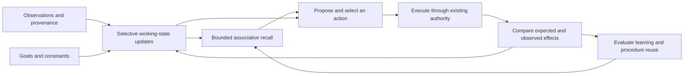

# Cognitive architecture research

This is a research design for a kernel that can maintain an objective, select
relevant information, act, inspect consequences and revise its behavior. It is
not a description of a completed cognitive subsystem. The experiments under
`research/cognition/` are opt-in research assets outside the shipped CLI; they
do not establish a new SDK contract or change default agent behavior.

The useful question is which mechanisms improve task performance under a fixed
resource budget. Naming classes after brain regions does not answer it. The
design below separates scientific findings, computational theories and proposed
engineering choices. It makes no claim to consciousness, biological fidelity
or an optimal architecture for intelligence.

## Scientific motivation and its limits

| Source | Finding or theory | Engineering adaptation to investigate |
| --- | --- | --- |
| [Miller and Cohen, 2001](https://www.annualreviews.org/content/journals/10.1146/annurev.neuro.24.1.167) | Their integrative theory proposes that maintained goals and rules bias processing elsewhere toward task-relevant behavior. Prefrontal control operates within distributed circuitry. | Preserve an explicit goal and current constraints, and make them influence retrieval and action selection. A goal field that never changes decisions provides little control. |
| [O'Reilly and Frank, 2006](https://doi.org/10.1162/089976606775093909) | Their computational working-memory model addresses rapid updating, resistance to distraction and selective updating. Learned gates can update inner-task information while preserving outer-task context. | Gate individual state updates. A tool observation may revise a subgoal's evidence without replacing the parent objective or unrelated constraints. The biological learning mechanism need not be reproduced to test this behavior. |
| [Dehaene, Kerszberg and Changeux, 1998](https://pubmed.ncbi.nlm.nih.gov/9826734/) | Their workspace model coordinates specialized processors through selective access and modulation. Its Stroop simulations distinguish routine processing from effortful coordination. | Publish selected state to the processes that need it, with bounded access to a common workspace. This is an architectural analogy; the simulation does not prove a universal software design. |
| [Botvinick and colleagues, 2001](https://doi.org/10.1037/0033-295X.108.3.624) | Two computational studies connect conflict detection with adjustments in cognitive control. The proposed feedback mechanism concerns demand for control, not a single-purpose error region. | Detect incompatible proposals, contradictory evidence and repeated failure, then change the next decision. An error log without a policy response leaves the loop incomplete. |
| [Fulvio and Postle, 2020](https://doi.org/10.5334/joc.98) | In a small TMS experiment, task relevance affected the status of unprioritized memory even when elapsed time was matched. Potentially useful information differed from information made irrelevant. | Separate the current focus from retained task state. Removing a fact from the next prompt need not discard its relationship to an unfinished task. The experiment does not establish a general software memory layout. |

These are interacting functions, not one region per class. In particular,
"frontal" does not mean a separate omniscient model. A controller must expose
how it obtains evidence and chooses transitions. Otherwise the explanation
merely moves the unexplained intelligence into another component.

[CoALA](https://arxiv.org/html/2309.02427v3) provides a closer software bridge:
it describes language agents using memory, internal and external actions, and
decision procedures. Its distinction among working, episodic, semantic and
procedural memory helps specify responsibilities. It is an organizing framework,
not evidence that every agent needs separate services or extra model calls for
each responsibility.

Three further mechanisms inform association and learning. The
[complementary learning systems account](https://stanford.edu/~jlmcc/papers/McCMcNaughtonOReilly95.pdf)
distinguishes rapid acquisition of specific experiences from gradual integration
into shared knowledge. This motivates preserving episodes while evaluating
reusable abstractions; a text summary alone does not reproduce neural consolidation.
[Hopfield's content-addressable model](https://www.its.caltech.edu/~jkenny/nb250c/papers/Hopfield-1982.pdf)
shows pattern recovery from partial cues under particular recurrent-network
assumptions. Its energy argument does not apply automatically to a semantic graph.
[Schultz, Dayan and Montague](https://www.gatsby.ucl.ac.uk/~dayan/papers/sdm97.pdf)
connect physiological responses to reward prediction error. That motivates
comparing prediction and outcome while keeping surprise, reward and truth separate.

For language-agent evidence, [A-MEM v11](https://arxiv.org/html/2502.12110v11)
evaluates linked and evolving memory using embeddings and additional model
inference. Its ablations motivate testing links, not assuming links always help.
[LongMemEval](https://arxiv.org/html/2410.10813v2) separates retrieval from answer
correctness and tests updates, temporal reasoning and abstention. Finding a
record and using it correctly are distinct measurements. Neither study proves
that this proposed controller improves Namzu's tool execution.

## Operational state and memory

The following terms define this proposal's data responsibilities. They do not
prescribe storage technology or anatomical locations.

| State | Operational meaning |
| --- | --- |
| Current focus | The selected evidence, constraints and candidates supplied to the next decision. It has a prompt and attention budget. |
| Retained task state | Goal, subgoals, unresolved questions, dependencies, failed attempts and continuation pointers that remain available even when absent from the current prompt. |
| Episodic memory | Source-bearing records of what was attempted, in which environment, and what was observed. An episode preserves temporal and causal context. |
| Semantic memory | Reusable claims derived from observations, with scope, provenance, revisions and supporting or contradicting evidence. A stored claim can be wrong. |
| Procedural memory | Reusable methods with preconditions, steps, expected outcomes and failure conditions. Applicability must be checked before reuse. |

Existing [structured memory](memory.md), [pinned facts](pinned-facts.md) and
the [salience working set](salience-working-set.md) cover parts of this space.
Their different lifetimes matter. A searchable historical record does not
automatically become current evidence; a pinned tool statement is not verified
merely because compaction retains it.

Four quantities must remain distinct. **Activation** is retrieval priority.
**Uncertainty** describes what the controller cannot yet discriminate or verify.
A **success estimate** predicts an action's outcome under specified conditions.
**Truth** is not assigned by any of these scores: operationally, the system
tracks claims and evidence, including conflicts and missing observations.
Repeated recall may increase availability while adding no independent support.
An agent's own confidence is another reported signal, not a verification result.

## A complete control cycle

Each stage below is an engineering proposal. Its transitions must be visible
in traces and independently testable.



1. **Perceive.** Normalize a user event, tool result or environment observation
   into a source-bearing record. Preserve the original artifact or a recovery
   pointer, observation time, scope and relevant environment revision. Record
   extraction uncertainty; a parser's interpretation is distinct from its input.
2. **Gate goal and working-state updates.** Decide which fields the event can
   update. Preserve unrelated task commitments. New operator steering can
   advance a goal version; ordinary retrieved text cannot grant itself that
   authority. Contradictions create an unresolved state until evidence or an
   authorized update resolves them.
3. **Recall associatively.** Seed retrieval from the current goal, entities,
   unresolved questions and observations. Expand a bounded candidate set through
   relevant links, then read and recheck selected records. Keep contradictory
   candidates distinguishable. Similarity, co-occurrence and previous utility
   can help discovery; none licenses a claim as current fact.
4. **Propose and select.** Construct a limited set of candidate plans or actions.
   Include internal actions such as retrieving evidence, revising a hypothesis
   or deferring an unsupported conclusion. Check preconditions, dependencies,
   authorization, estimated cost and the observation expected after execution.
   Selection must explain which evidence distinguishes its choice.
5. **Execute.** Run the selected action through the existing tool and permission
   boundaries. Assign an attempt identity and retain results, including partial
   failures. Parallel actions require compatible dependencies and resource
   reservations. A request accepted by a tool is not evidence that its intended
   real-world effect occurred.
6. **Compare expectation, observation and evidence.** Match the result against
   the prediction and the goal's completion criteria. Distinguish execution
   failure, an unexpected outcome, incompatible evidence and an unobserved
   outcome. Completion requires relevant evidence for the applicable goal
   version; a plausible closing answer is insufficient.
7. **Adjust control and learn.** Choose whether to continue, gather different
   evidence, change the plan, invalidate a precondition or end with an explicit
   unresolved result. Save the episode. Propose reusable claims or procedures
   only with their supporting scope and evidence. Further validation determines
   whether they become eligible for reuse.

For example, a build succeeds at revision A, then an edit produces revision B.
The earlier success remains a valid episode about A. It does not satisfy B's
completion condition. If a new user instruction changes the requested artifact,
the controller must also reconsider which previous checks still apply.

## Versions, gates and association

The following equation is our software abstraction of selective updating, not
a neuroscience derivation. For state field `i`, observation `o` and gate `g`:

```text
W_next[i] = update(W[i], o)   if g(i, W, o) permits this update
W_next[i] = W[i]             otherwise
```

The gate evaluates source privileges, scope and expected versions before
committing an update. An update records its reason and evidence; invalidation
is explicit. Goal changes, evidence changes and environment changes have
separate revisions because they invalidate different conclusions. A delayed
worker result can remain useful evidence while its proposed state mutation
is rejected as stale.

Candidate decisions carry the goal version, evidence revision and environment
revision they used. Recheck affected preconditions before execution. An external
system may change after that check, so retain observed outcomes and use
transactional or conditional external operations where available. Local version
checks alone cannot make the outside world atomic.

A "neuron" in an associative prototype is at most a named computational node;
a "synapse" is at most a weighted relationship. Neither is a biological neuron
or synapse. Prefer record and edge terminology in APIs. Distinguish edges for
shared context, support, contradiction and procedural applicability. Bound
neighbor expansion and iterations so recurrent activation cannot consume
unbounded compute. Audit hub bias separately; normalization alone does not
guarantee that a highly connected record will not dominate retrieval.

The executable graph uses this proposed numerical rule:

```text
a_next = (1 - alpha) q + alpha transpose(P) a
```

Here `q` and `a` are probability vectors, each admitted row of `P` sums to one,
and `0 <= alpha < 1`. Dangling nodes have self loops. The transition preserves
nonnegative unit mass; its L1 distance between two states is at most `alpha`
times their previous distance, giving a unique fixed point. Finite iteration
limits still require reporting the residual. This is restart diffusion with a
software proof, not a claim that brains use this rule. Edge types describe
relationships; none of them certifies truth or grants an action permission.

The experiment's expected-effect estimate uses `p_next = p + eta (y - p)` for
an attributable binary outcome. It remains in `[0, 1]` for `0 < eta <= 1`, but
is not automatically calibrated or a measure of goal utility. Unknown outcomes
and retrieval events cannot train it. Known observation-only procedures are
excluded from intervention ranking even when their predictions are accurate.

Adaptation may initially change retrieval weights or procedure eligibility
using observed outcomes. That is local learning in an external data structure,
not training the language model. Logging a success does not identify every
causally useful memory. Weight updates therefore need an explicit attribution
rule and evaluation against frozen weights and simple lexical retrieval.

## Resource and SDK boundaries

CPU work includes indexing, bounded graph expansion, scheduling and checks.
GPU work may include local embeddings or model inference, but is optional.
I/O includes artifact reads, disk updates, network tools and provider requests.
Set independent limits for candidate count, expanded edges, elapsed time,
resident memory, bytes read, tool calls and model tokens. Charge retries,
validation and background activity to the same task budget. Reserve shared
capacity before dispatching concurrent work.

An algorithmic limit bounds requested work; it does not enforce operating-system
CPU, memory or GPU isolation. Cancellation may stop waiting while an underlying
operation continues. Measurements must include that work. Hard resource
boundaries require an executor or environment that actually enforces them.
Report provider inference separately from local resource use.

The [storage research](cognitive-storage.md) examines Pydantic AI's notebook,
conversation retrieval and execution persistence separately. It proposes scoped
candidate selection before payload reads, transactional revisions and bounded
RAM working sets. A small returned prompt is not evidence of a small disk-read
or indexing cost.

The existing SDK supplies useful integration seams:

* `prepareStep` shapes the next request and can support selected context or
  phase-specific tools. Stages run in order and failures are skipped: it fails
  open and is unsuitable as the sole enforcement boundary.
* `beforeStep` can refuse the next model call and fails closed on exceptions.
  This does not itself validate every tool outcome or certify task completion.
* `reviewAnswer` can return feedback for another attempt, subject to its review
  limit. It fails open on exceptions and is bypassed on forced-final turns.
  Other termination paths also mean it is not a universal completion gate.

A research host must evaluate final evidence independently of answer prose and
the answer-review callback. Integration must preserve the existing executor,
permission policy, cancellation and budget accounting. Proposed privileged
state updates are host-enforced operations, not instructions placed in memory.

The advisory-input audit identified two concrete distinctions to preserve:
context fullness measures the pending request against its context window,
whereas cumulative token spend measures run cost; an error-triggered review
needs the current failing tool cycle, rather than an older error surviving in
history. Their regression checks are evidence about input plumbing, not about
the effectiveness of the proposed controller.

## Experiments and promotion criteria

The experimental assets isolate mechanisms for inspection:

* `research/cognition/executive.mjs` and its test exercise controller transitions.
* `research/cognition/association.mjs` and its test exercise local associations.
* `research/cognition/sdk-probe.mjs` exercises public SDK seams with a scripted
  provider and zero external model calls. It connects retrieved procedures,
  expected-effect feedback, tool admission and independent completion evidence.
* `research/cognition/resource-probe.mjs` measures bounded graph computation.
* `research/cognition/storage-probe.mjs` measures payload materialization in the
  current disk store and a research-only local text index.
* `research/cognition/README.md` documents execution and experimental limits.

Deterministic scenarios demonstrate particular transitions, not improvements
on real tasks. The shipped CLI does not load these assets. A later production
integration remains a separate change.

Test the following hypotheses with preregistered scoring rules:

* Selective state updates reduce lost constraints during distractions, nested
  work and interruption. Compare full replacement, recency retention and gates.
* Associative expansion improves retrieval of useful indirect evidence without
  increasing stale-claim use. Compare lexical search, direct similarity and
  bounded expansion, using the same underlying records.
* Evidence comparisons improve recovery and completion accuracy. Remove the
  comparison stage, then separately remove its feedback into action selection.
* Outcome-conditioned adaptation improves later tasks. Compare learned weights
  with frozen weights and shuffled outcomes to detect benefit from chronology
  or repeated exposure alone.

Keep models, tools, permissions, starting records and task seeds comparable.
Match total inference-token and tool-call budgets, and report local CPU time,
GPU time when present, I/O, wall time and storage overhead. Extra retrieval or
verification calls count toward the intervention. Where costs cannot all be
matched simultaneously, report performance across explicit budget levels.

Use chronological held-out tasks: learning sees only earlier episodes; evaluation
cannot retrieve future answers, later corrections or hidden test observations.
Separate tuning, validation and final test periods, and include project shifts,
changed environments, misleading memories and deliberate distractions. Keep
memory snapshots and implementation revisions so results can be reproduced.

Score task success, unsupported completion claims, constraint violations,
retrieval usefulness, stale-evidence reuse, recovery attempts and resource cost.
Report uncertainty across repeated runs and task families, including regressions.
Promotion into the SDK requires a demonstrated benefit under these comparisons,
bounded operational cost and a clear ownership contract for state transitions.
Until then, this remains a falsifiable design with small experimental probes.
