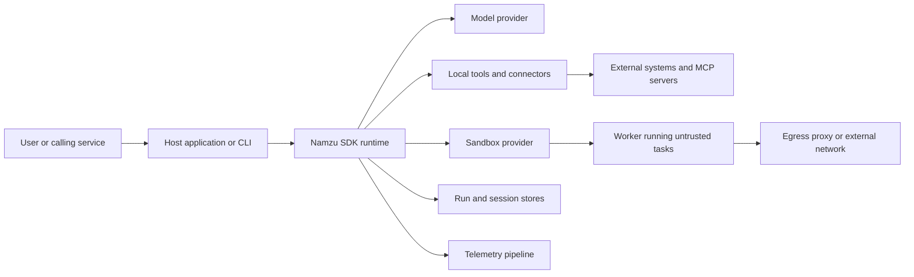

# Namzu Project Security Report

## 1. Document Control

| Field | Value |
| --- | --- |
| Intended audience | IT security, platform engineering, application security, risk owners, and technical leadership |
| Assessment type | Source-based architecture and security posture review |
| Repository snapshot | `f58a086f788a202332d8e1e2f49952bcff42fc1a` |
| Snapshot date | 2026-08-11 |
| Publication context | Repository documentation; detailed findings are derived from source that is already publicly visible when the repository is public |
| Overall disposition | Conditionally suitable for a controlled, single-tenant pilot after deployment hardening; not approved by this assessment for adversarial multi-tenant production until the Priority 0 findings are remediated and verified |
| Next review | After Priority 0 remediation, before a multi-tenant production launch, or within 90 days, whichever comes first |

This report describes the controls that are evidenced in the assessed source snapshot. It is not a penetration-test certificate, a compliance attestation, a guarantee about a particular deployment, or a substitute for an environment-specific threat model.

### 1.1 Status since the assessed snapshot

Added 2026-08-13, when this report was committed. **Everything below assesses `f58a086f`, and `main` has moved since.** The findings are left exactly as written, because a dated assessment that gets edited to match later code stops being a record of what was true.

Fixes have landed against several findings. Each line here was checked by confirming the artifact exists on `main`, not by re-testing the finding:

| ID | Landed | Evidence on `main` |
| --- | --- | --- |
| NAMZU-SEC-003 | Remote read-only metadata no longer drives approval by itself | `packages/sdk/src/tools/trusted-read-only.ts`, wired into the verification rule, the plan-mode gate and the CLI prompt exemption |
| NAMZU-SEC-004 | Egress decides by resolved address, and the container tier no longer trusts a network by name | `packages/sandbox/src/egress/address.ts`; `assertNotPubliclyAddressed` in the standby-pool backend; `assertNetworkCarriesThePolicy` in the docker backend |
| NAMZU-SEC-006 | Sandbox configuration is read field by field rather than shape-only | `packages/cli/src/context/sandbox.ts` and the `sandbox` reader in the CLI config loader |
| NAMZU-SEC-008 | Connector results are framed with the server that produced them, and a screen runs at the tool boundary | `packages/sdk/src/connector/mcp/adapter.ts`; `packages/sdk/src/registry/tool/screen.ts` |

**NAMZU-SEC-005 is still open.** The worker's own docblock still reads `Authn: none`. Design work is tracked on the repository's issue for per-instance short-lived credentials.

**Every other finding was not re-verified.** Absence from the table above means "not checked on 2026-08-13", not "still open" and not "closed" — treat those as carrying their original status until someone re-runs the assessment.

## 2. Executive Summary

Namzu is a TypeScript AI-agent platform delivered as a core SDK, an operator CLI, provider drivers, connector and tool integrations, optional computer-use and file capabilities, sandbox backends, telemetry, and evaluation packages. It is a library and operator application rather than a hosted service. Consequently, Namzu supplies security primitives, but the application embedding it remains responsible for service authentication, authorization, transport security, key management, network policy, data retention, and incident operations.

The architecture demonstrates deliberate security engineering in several important areas:

- tool execution passes through a configurable permission gate with deny-first dangerous patterns, operator rules, human-review outcomes, and run-scoped grants;
- sandbox backends report the isolation controls they can actually provide and can refuse a workload when required controls are unavailable;
- paths are checked for lexical traversal and symlink escape, while documented residual time-of-check/time-of-use limitations are not hidden;
- model, tool, token, time, delegation, and output budgets limit several forms of runaway execution;
- session stores enforce tenant ownership in their principal read and mutation paths, and durable checkpoints use claims and fencing for recovery integrity;
- provider error handling truncates and redacts upstream response bodies instead of exposing them directly;
- CLI provider credentials receive owner-only filesystem protections with a read-back verification step;
- the reference microVM client contract supports bearer authentication and optional mutual TLS with TLS 1.3;
- CI applies frozen-lockfile installation, type, lint, build, test, package-content, consumer-install, public-API, documentation, and sandbox smoke gates; and
- package publication enables npm provenance.

These controls form a credible security foundation, but the assessed snapshot also contains high-impact gaps at the boundaries where model-controlled data reaches credentials, networks, remote tools, and shared workloads. The most important issues are:

1. generic HTTP and webhook connectors can replace their configured destination with a model-controlled destination while configured credentials or signatures remain attached;
2. credential retrieval and revocation are not tenant-bound at the vault interface, and the tenant connector manager does not independently verify ownership;
3. remote MCP servers can self-declare a tool as read-only, and that untrusted annotation can cause default automatic approval;
4. Docker egress allowlisting depends on proxy environment variables rather than packet-level enforcement, so arbitrary code can bypass it;
5. the sandbox worker is unauthenticated and listens on all interfaces, which is unsafe on a shared workload network;
6. the committed egress proxy does not reject private, loopback, link-local, or otherwise inward resolved addresses;
7. the CLI does not attach a sandbox provider by default, while headless automatic mode can execute allowed shell and file operations directly on the host;
8. untrusted tool and connector results are not systematically framed or reinspected before the next model call; and
9. the reference image and release workflow require additional dependency and supply-chain hardening.

The recommended decision is therefore conditional:

- A controlled internal or single-tenant pilot can be reasonable if it uses strict tool rules, isolated credentials, enforced network controls, a private worker control plane, protected storage, and the baseline in Section 10.
- An adversarial multi-tenant deployment should not rely on the assessed defaults. It should close and verify all Priority 0 findings, prefer the microVM backend for untrusted workloads, and validate the final infrastructure through penetration testing and workload-isolation testing.

No evidence of a formal security certification, completed penetration test, external audit, signed SBOM program, or production cloud-control assessment was found. This report does not infer any of those outcomes.

## 3. Scope, Method, and Limitations

### 3.1 Included

The review covered:

- all fourteen package manifests in the workspace;
- `@namzu/sdk`, including runtime, tools, connectors, MCP, plugins, guardrails, permissions, stores, and provider-facing error handling;
- `@namzu/cli`, including configuration, trust, permissions, credentials, and headless behavior;
- `@namzu/sandbox`, including local, Docker, and microVM backends, egress controls, the reference worker, and the reference image;
- `@namzu/computer-use`, `@namzu/files`, `@namzu/telemetry`, and evaluation surfaces where they change privilege, data, or observability boundaries;
- repository workflows, release automation, documentation, tests, package metadata, and dependency manifests; and
- a point-in-time production dependency advisory check using the workspace lockfile.

The analysis used source code, tests, configuration, and workflow definitions as primary evidence. Published documentation was treated as explanatory evidence and was checked against source when a security claim depended on it. External references were limited to authoritative English-language standards and advisory sources.

### 3.2 Excluded

The following were not assessed or were unavailable:

- live cloud, Kubernetes, container-runtime, firewall, DNS, identity-provider, secrets-manager, or telemetry-collector configuration;
- organization and repository settings that are not represented in the repository;
- provider-side storage, training, retention, regional processing, abuse monitoring, or contractual controls;
- dynamic penetration testing, red teaming, fuzzing, malware analysis, and sandbox escape testing;
- a built-container operating-system and package vulnerability scan;
- production data classification, privacy impact analysis, legal or regulatory applicability, and business-continuity evidence;
- administrator and developer endpoint security; and
- uncommitted working-tree changes. In particular, uncommitted sandbox egress changes present during the review are not counted as controls in the assessed snapshot.

The production dependency audit reported no known vulnerabilities in dependencies represented by the workspace lockfile on 2026-08-11. This result does not cover globally installed dependencies in Dockerfiles, base-image packages, Python or operating-system packages outside the lockfile, malicious packages, unknown vulnerabilities, or runtime configuration.

### 3.3 Status vocabulary

| Status | Meaning |
| --- | --- |
| Implemented | Directly evidenced in source and supported by relevant tests or fail-closed behavior |
| Partial | Present, but coverage, defaults, or attack resistance are incomplete |
| Deployment-dependent | A platform capability exists, but the embedding application or infrastructure must configure and enforce it |
| Not evidenced | No reliable implementation or assurance evidence was found in the assessed scope |

### 3.4 Risk rating model

| Rating | Interpretation |
| --- | --- |
| Critical | Direct and broadly reachable systemic or cross-tenant compromise with little precondition |
| High | Credible high-impact compromise, secret or data disclosure, policy bypass, or release compromise under a realistic deployment condition |
| Medium | Material defense gap requiring a specific configuration, trust decision, or chained precondition |
| Low | Limited-impact hardening or governance weakness |
| Informational | Architectural fact, accepted residual risk, or deployer responsibility |

Ratings describe the source snapshot before the deployment checklist is applied. They are not CVSS scores and should be recalibrated against the actual exposure, data classification, and tenant model.

## 4. System and Security Architecture

### 4.1 Product boundary

Namzu provides an agent runtime and operator tooling. It does not, by itself, provide a public API gateway, identity provider, database service, web application firewall, enterprise key-management service, or hosted control plane. The host application chooses which providers, tools, connectors, stores, plugins, sandboxes, and telemetry exporters are enabled.

The dependency direction is intentionally one-way: the SDK is the kernel, and the CLI, capability packages, telemetry, evaluations, sandboxes, and provider drivers depend on it. This reduces circular trust and keeps the core runtime independent of optional high-privilege capabilities.

### 4.2 High-level data flow

The principal trust boundaries are:

1. **Caller to host.** The host authenticates the caller, maps the caller to a tenant and role, and selects the agent and tool policy.
2. **Host to model provider.** Prompts, tool schemas, and possibly retrieved or user-supplied data cross into a provider trust domain.
3. **Model to tool.** Model-generated arguments cross from probabilistic output into deterministic code with filesystem, network, process, or external-system privileges.
4. **Runtime to extension.** Agent modules and plugins execute as trusted host-process code unless deliberately skipped or restricted.
5. **Runtime to remote integration.** Connectors and MCP servers can return attacker-controlled content and may perform externally visible operations.
6. **Runtime to sandbox.** The sandbox receives code, commands, files, credentials, and resource limits; the actual isolation guarantee depends on the selected backend.
7. **Sandbox to network.** Untrusted code may attempt direct, proxied, DNS-rebinding, metadata-service, or internal-network access.
8. **Runtime to persistence and telemetry.** Messages, tool inputs, tool outputs, errors, identifiers, and checkpoints may become durable or leave the process.
9. **Source to release.** Third-party dependencies, workflow actions, build jobs, registries, provenance, and publishing credentials form the software supply chain.

### 4.3 Assets requiring protection

- provider API keys, connector credentials, webhook secrets, sandbox-injected secrets, and publishing credentials;
- prompts, uploaded files, retrieved content, tool inputs and outputs, session history, and generated artifacts;
- tenant identity and authorization context;
- tool integrity, approval decisions, and policy configuration;
- sandbox host, sibling workloads, internal network services, and cloud metadata endpoints;
- checkpoints, claims, audit events, and telemetry integrity;
- package source, build workflows, artifacts, provenance, and release authority; and
- human operator trust, especially where the agent explains or recommends high-impact actions.

### 4.4 Threat actors and failure modes

The assessment assumes potentially malicious end users, compromised tenant credentials, indirect prompt injection in external content, malicious or compromised MCP servers and plugins, crafted uploaded files, vulnerable dependencies, model mistakes, runaway tool loops, compromised sibling workloads, and supply-chain compromise. A trusted administrator or host with unrestricted operating-system access remains outside the isolation boundary.

## 5. Implemented Security Controls

### 5.1 Identity, tenant context, and durable execution

**Status: Implemented with one connector-vault exception.**

Runtime IDs distinguish tenants, projects, sessions, runs, tasks, agents, and requests rather than collapsing them into a single string namespace. Disk-backed session stores verify tenant ownership before principal read and mutation operations, and the test suite contains cross-tenant isolation cases. Durable checkpoints, claims, fencing, atomic replacement, and idempotent recovery reduce duplicate execution and stale-worker corruption after restarts.

The important exception is the generic connector credential vault described in `NAMZU-SEC-002`: its retrieval and revocation contracts are keyed only by credential reference, not by tenant, and the connector manager does not add an ownership check.

### 5.2 Tool permission gate and human review

**Status: Implemented; policy quality and metadata trust remain deployment-dependent.**

The permission gate applies hard dangerous-operation patterns before operator rules. A disabled gate yields review rather than allow, invalid custom regular expressions are rejected or skipped with a warning, and unmatched operations require review. Grants are scoped to a run and can apply to one normalized call or one tool rather than becoming durable global permissions.

The default sandbox gate allows declared read-only, filesystem, analysis, and custom operations while routing network and shell operations to review. This is a practical usability baseline but should not be treated as a production authorization policy: category and read-only metadata can be supplied by tool authors or remote MCP servers, and regular-expression classification cannot understand every operation's semantics.

Production hosts should define local rules from an asset and action inventory, keep high-impact network, credential, code-execution, destructive, and computer-use operations reviewable, and bind approvals to authenticated users and auditable run context.

### 5.3 Guardrails and untrusted-content handling

**Status: Partial.**

Input guardrails run before the model and output guardrails run before the final response is returned. A guardrail exception fails the run rather than being silently ignored, and multiple rewrites compose in order. Presets include common secret patterns and a heuristic prompt-injection detector.

Agent results and MCP prompt content can be wrapped in an explicit untrusted-data envelope, including delimiter neutralization. This is useful defense in depth against instruction/data confusion. It is not a security boundary, and it is not systemic: remote MCP tool results and connector results are not covered by the same envelope. The input prompt-injection guardrail also cannot inspect tool results that arrive later in the run.

Output secret scanning applies to the final result after live deltas may already have been emitted. Sensitive deployments must therefore buffer output or implement incremental scanning before delivery. Guardrails are optional and their pattern coverage is intentionally incomplete; secrets should be brokered and scoped so that model-visible text does not contain reusable credentials.

### 5.4 Filesystem safety

**Status: Partial; strong SDK helpers are not used by every package.**

Path helpers prevent lexical traversal, verify real paths against the configured root, and reject symlink escapes. Directory discovery avoids traversing symlinked directories and applies depth constraints. These controls materially reduce common workspace escape attacks.

There is a remaining time-of-check/time-of-use race between validation and a later open because the current implementation cannot atomically open relative to a trusted directory descriptor with all desired flags. The CLI file-mention path and file-package blob stores also do not consistently reuse these helpers: lexical checks can follow symlinks, and imported or forged storage references can bypass local-root or cloud-prefix assumptions. Highly adversarial file workflows should run inside an isolated filesystem, avoid writable shared ancestors, and use operating-system controls as the primary boundary. See `NAMZU-SEC-014` and `NAMZU-SEC-015`.

### 5.5 Sandbox isolation and resource governance

**Status: Capability-aware and partially enforced.**

Namzu models filesystem, network, and process isolation as explicit capabilities. macOS local execution reports stronger controls than Linux local execution; the basic tier reports no isolation. A caller can require particular controls, and the sandbox refuses execution if the backend cannot provide them. This is a strong design property because the API does not pretend that every backend is equivalent.

The sandbox packages also enforce time, output, memory, process, and related resource limits. The Docker backend drops Linux capabilities, enables `no-new-privileges`, defaults to no network, can apply memory and process ceilings, and can set an explicit runtime user. The reference worker image switches to a non-root `namzu` user. The microVM client contract offers the strongest potential boundary represented in the repository, with control-plane bearer authentication, optional mutual TLS, and separation between injected credentials and returned orchestration data. Hypervisor isolation and external orchestrator enforcement were not available for verification in this review.

The safe result depends on configuration. The local provider requires no isolation controls by default. Docker network allowlisting is not a packet-enforced boundary in the assessed snapshot, and the worker control plane is unsafe on shared networks. The ACI standby-pool backend can omit a subnet, receive a public IP, and call the same unauthenticated worker over plain HTTP. These limitations drive several Priority 0 findings.

### 5.6 Secrets and credentials

**Status: Partial and deployment-dependent.**

CLI provider credentials are created with owner-only permissions on POSIX systems and a current-user-only access-control list on Windows, and the resulting permissions are verified after creation. Provider error normalization truncates upstream bodies, redacts likely secrets, and avoids retaining the raw cause in the returned error object.

The SDK deliberately leaves the durable credential vault abstraction to the host. Production systems should use a managed secret store, tenant-bound access control, short-lived credentials where possible, key rotation, access records, and separate identities per environment and connector. Static bearer and webhook credentials must never be sent to a destination controlled by model output.

### 5.7 Persistence, privacy, and telemetry

**Status: Deployment-dependent.**

Disk stores can contain messages, transcripts, tool arguments, tool outputs, checkpoints, and execution metadata in plaintext files. The generic store writer provides atomicity but does not itself create an encryption or enterprise access-control boundary. The deployer must protect the runtime directory and backups, define retention and deletion, encrypt storage, and ensure tenant separation at the operating-system and infrastructure levels.

Telemetry focuses on identifiers, models, usage, tool status, and timing rather than intentionally recording full prompts. However, raw tool errors can be attached to spans or recorded as exceptions and may contain sensitive input or provider detail. A production telemetry pipeline needs a redaction processor, encrypted transport, authenticated collectors, role-based access, retention limits, and a documented policy for prompt and content capture.

### 5.8 Resilience and runaway-execution controls

**Status: Implemented with deployment tuning required.**

Namzu supports budgets for model calls, tokens, time, delegation, tool execution, and output. These controls limit cost explosion, unbounded recursion, excessive output, and some cascading-failure modes. Checkpoints and idempotent recovery improve operational resilience.

Budgets are not a substitute for rate limits, per-tenant quotas, provider spend limits, circuit breakers, and queue isolation. The host should set conservative defaults and monitor repeated denials, tool loops, retry storms, approval frequency, unusual token growth, and cross-agent delegation depth.

### 5.9 Extension and integration admission

**Status: Partial.**

Directory loading can skip module evaluation, and plugin manifests are validated. Plugins can be restricted by allowed scope, while MCP servers support allow and deny policies. Deny rules take precedence.

Agent modules and plugins that are evaluated execute trusted top-level code in the host process; a timeout does not cancel side effects already in progress. If no plugin scope restriction is supplied, both project and user plugin locations may be considered. If no MCP admission policy is supplied, all advertised tools are admitted, and tool-set drift is reported rather than blocked. Production should use explicit allowlists, pinned extension sources, change review, and process isolation for code that is not part of the trusted application build.

### 5.10 Secure development and release controls

**Status: Broad validation; supply-chain hardening is partial.**

Pull requests and merge queues run frozen-lockfile installation, lint, type checking, builds, tests, process-level tests, evaluation checks, coverage and test-presence checks, package-content checks, consumer installation, public-API checks, documentation validation, and sandbox smoke tests. Release automation uses Changesets and npm provenance, reducing manual version and publication errors.

Residual gaps include mutable major-version workflow-action references, use of an unpinned latest-version package validator, broad write and OIDC permissions in the release job before validation is complete, and no evidenced repository-wide SAST, fuzzing, automated dependency-update service, SBOM gate, artifact-signature verification gate, or continuous OpenSSF Scorecard policy. These gaps do not negate the existing gates, but they leave release authority and dependency risk less constrained than a high-assurance supply chain requires.

### 5.11 CLI execution boundary

**Status: High-impact host execution by design; strict deployment controls required.**

The CLI registers SDK shell and file tools but does not attach a sandbox provider to its normal query path. Shell commands therefore fall back to host process execution in the workspace and inherit the process environment plus configured context. File tools likewise operate on the host workspace. Interactive sessions ask for approval for material mutations, and folder trust reduces accidental execution in unfamiliar repositories, but these measures are not process isolation.

In headless operation, unmatched calls can resolve to automatic execution. Combined with a trusted repository, injected instructions in repository content, broad environment credentials, a Docker socket, or cloud metadata reachability, this creates a high-impact automation boundary. CI and unattended use must select strict permission mode explicitly, run in an ephemeral least-privilege environment, expose only required credentials, and use operating-system or container isolation outside the CLI.

## 6. AI-Agent Threat Mapping

This mapping uses the OWASP Top 10 for Agentic Applications as an assessment lens. It is not a claim of OWASP certification or complete conformance.

| Agentic risk | Current controls | Residual exposure and required action |
| --- | --- | --- |
| ASI01 Goal Hijack | Input guardrails, untrusted envelopes for some content, tool approvals, budgets | Tool and connector results are not systematically framed or rescanned; headless host execution increases impact; enforce local policies, provenance labels, content isolation, and high-impact approval |
| ASI02 Tool Misuse and Exploitation | Permission gate, dangerous patterns, run-scoped grants, sandboxing | Connector destination override, uniform non-destructive labels, and self-declared metadata can undermine policy; remediate `NAMZU-SEC-001` and `NAMZU-SEC-003` |
| ASI03 Identity and Privilege Abuse | Typed tenant and run identities, session-store tenant checks, credential-file ACLs | Credential references are not tenant-bound at the vault boundary; require tenant-aware retrieval and revocation |
| ASI04 Agentic Supply Chain Vulnerabilities | Frozen lockfile, CI matrix, package checks, npm provenance | Reference image dependency advisory, mutable workflow references, and absent SBOM/signature gates remain; remediate `NAMZU-SEC-009` and `NAMZU-SEC-011` |
| ASI05 Unexpected Code Execution | Sandboxes, resource limits, permission review, local path checks | The CLI executes allowed shell tools on the host, plugins and modules are trusted host code, and local and Docker defaults are insufficient for adversarial multi-tenancy |
| ASI06 Memory and Context Poisoning | Session identity, durable records, partial untrusted framing | Later tool content can enter context without systemic provenance or injection screening; separate trusted instructions from external data and add post-tool inspection |
| ASI07 Insecure Inter-Agent Communication | Typed agent/run identity, budgets, structured runtime records | Content authenticity and authorization remain host concerns; bind delegations and messages to authenticated run context and audit them |
| ASI08 Cascading Failures | Token, time, tool, output, and delegation budgets; checkpointing and recovery | Add per-tenant quotas, queue isolation, provider circuit breakers, and anomaly monitoring |
| ASI09 Human-Agent Trust Exploitation | Human-review outcome and explicit approval flows | UI and host must present destination, identity, data exposure, side effects, and provenance clearly; do not describe state-changing connector calls as non-destructive |
| ASI10 Rogue Agents | Deny-first patterns, sandbox selection, run-scoped grants, budgets | A compromised agent can still exploit admitted connectors, remote metadata, and network gaps; require local capability policy and enforced containment |

## 7. Risk Register

### 7.1 Summary

| ID | Severity | Finding | Primary owner |
| --- | --- | --- | --- |
| NAMZU-SEC-001 | High | Model-controlled connector destinations can receive configured credentials or attacker-chosen signatures | SDK maintainers |
| NAMZU-SEC-002 | Medium | Connector credential references are not bound to tenant authorization | SDK maintainers and vault implementers |
| NAMZU-SEC-003 | High | Remote MCP read-only metadata can drive automatic approval | SDK maintainers and deployment owners |
| NAMZU-SEC-004 | High | Docker egress policy is bypassable in routable configurations and lacks inward-address screening | Sandbox maintainers and platform engineering |
| NAMZU-SEC-005 | High | Sandbox worker control API can be unauthenticated on shared or public networks | Sandbox maintainers and platform engineering |
| NAMZU-SEC-006 | Medium | Invalid CLI configuration can silently remove configured permission rules | CLI maintainers and operators |
| NAMZU-SEC-007 | High | Headless CLI can execute model-selected tools directly on the host | CLI maintainers and operators |
| NAMZU-SEC-008 | High | Untrusted-content controls do not cover every model-visible result path | SDK maintainers and host applications |
| NAMZU-SEC-009 | Medium | Reference sandbox image includes a known vulnerable file-processing component | Sandbox maintainers and supply-chain owners |
| NAMZU-SEC-010 | Medium | Local isolation requirements default to empty | SDK maintainers and deployment owners |
| NAMZU-SEC-011 | High | Release validation executes mutable dependencies with publication authority | Repository and release owners |
| NAMZU-SEC-012 | Medium | Durable data and raw error telemetry require explicit protection | Deployment owners |
| NAMZU-SEC-013 | Informational | Plugins and evaluated modules are trusted host-process code surfaces | SDK maintainers and deployment owners |
| NAMZU-SEC-014 | Medium | CLI file mentions can follow symlinks outside the workspace | CLI maintainers |
| NAMZU-SEC-015 | Medium | Blob-store references are not revalidated on read, metadata, or delete | Files package maintainers and host applications |
| NAMZU-SEC-016 | Medium | Security assurance documentation contradicts source in material areas | Security and documentation owners |

No Critical finding is assigned because each high-impact path still requires a deployment condition such as an admitted connector, knowledge of a credential reference, a trusted MCP registration, headless execution in a trusted folder, a routable sandbox network, or a public or shared worker network. Those conditions are realistic, so the findings remain High.

### 7.2 Detailed findings

#### NAMZU-SEC-001 — Model-controlled connector destinations can receive configured credentials or attacker-chosen signatures

- **Severity:** High
- **Affected components:** generic HTTP connector, webhook connector, connector-to-tool bridges
- **Condition:** an agent can invoke the connector, and attacker-controlled or injected content can influence the connector's path or URL argument
- **Impact:** API key or bearer-token disclosure, server-side request forgery, calls into internal services, and use of the webhook secret as a signing oracle for attacker-chosen content
- **Evidence:** `packages/sdk/src/connector/builtins/http.ts`, `packages/sdk/src/connector/builtins/webhook.ts`, `packages/sdk/src/connector/builtins/webhook.test.ts`, `packages/sdk/src/bridge/tools/connector/adapter.ts`

The generic HTTP connector resolves the model-visible `path` with `new URL(path, base)`. Absolute and scheme-relative inputs can therefore replace the configured origin. Default and authorization headers are then attached to the resulting request. The webhook connector explicitly permits an input URL to replace its configured URL, continues to attach configured bearer headers, and can generate an HMAC over attacker-chosen payload content. Fetch redirects are not constrained by a per-hop destination policy. Connector bridge tools also mark methods uniformly as non-destructive, even when a method performs POST, DELETE, webhook, or other state-changing network work.

**Required remediation:** Require relative paths by default and verify that the normalized destination origin equals the configured origin. Reject user-info, scheme changes, scheme-relative paths, and unexpected ports. Disable automatic redirects or validate every hop before following it; strip credentials on any permitted origin change. Make alternate destinations an explicit allowlist with separate credentials. Remove model control over signed webhook destinations, and bind signatures to destination, timestamp, nonce, and replay policy where the receiving protocol supports it. Represent connector method impact with locally trusted read-only, destructive, network, and data-exposure metadata. Add tests for absolute URLs, `//host` paths, redirects, DNS rebinding, internal destinations, header stripping, and signature misuse.

**Verification:** A security test must show that credentials are never sent and signatures are never produced when any normalized destination or redirect is outside the configured policy.

#### NAMZU-SEC-002 — Connector credential references are not bound to tenant authorization

- **Severity:** Medium
- **Affected components:** credential vault contract, in-memory vault, tenant connector manager
- **Condition:** an attacker or confused deputy can submit a valid credential reference belonging to another tenant
- **Impact:** cross-tenant credential use, connector impersonation, unauthorized revocation, and possible access to another tenant's external systems
- **Evidence:** `packages/sdk/src/types/connector/tenant.ts`, `packages/sdk/src/vault/InMemoryCredentialVault.ts`, `packages/sdk/src/manager/connector/tenant.ts`

Credential creation and listing carry tenant context, but retrieval and revocation accept only the credential reference. The in-memory implementation stores tenant ownership without verifying it during retrieval or revocation. `connectWithCredential` retrieves the supplied reference and applies it to the requested tenant's connector instance without an independent ownership check. Random references reduce accidental discovery but are not authorization. Namzu does not ship a remotely reachable API that directly exposes this manager, so exploitation also depends on a host application accepting or leaking a foreign reference. A wrapper that accepts tenant-controlled credential IDs without its own ownership check should raise this deployment-specific risk to High.

**Required remediation:** Change vault retrieval and revocation to require tenant identity and verify ownership atomically. Return a generic not-found result for wrong-tenant references. Include tenant identity in audit records and apply the same rule in every durable vault adapter. Consider opaque handles that are meaningful only within one authenticated tenant context. Add cross-tenant negative tests for retrieve, connect, rotate, list, and revoke.

**Verification:** A credential reference created under tenant A must be unusable, unlistable, unrotatable, and unrevocable from tenant B, including under concurrent operations.

#### NAMZU-SEC-003 — Remote MCP read-only metadata can drive automatic approval

- **Severity:** High
- **Affected components:** MCP connector adapter, MCP admission and drift policy, default permission rules
- **Condition:** a compromised or malicious admitted MCP server describes a state-changing tool as read-only
- **Impact:** automatic execution of destructive or externally visible actions without the intended operator review
- **Evidence:** `packages/sdk/src/connector/mcp/adapter.ts`, `packages/sdk/src/connector/mcp/policy.ts`, `packages/sdk/src/verification/gate.ts`, `packages/sdk/src/verification/presets.ts`

The MCP adapter maps remote `readOnlyHint` annotations into Namzu tool metadata. The default permission preset can automatically approve tools declared read-only. With no local admission policy, advertised tools are accepted, and tool-set drift is observed rather than blocked. A remote server is therefore able to make a security-relevant claim about its own tool that influences the approval decision.

**Required remediation:** Treat remote annotations as descriptive and untrusted. Require a local policy to assign any auto-approvable read-only classification. Default unknown and changed tools to review or deny, and provide a strict mode that blocks unapproved schema or metadata drift. Bind policy to server identity, tool name, schema digest, destination class, and locally reviewed capability. Surface changed annotations to operators as a new approval event.

**Verification:** A test server that changes a tool from read-only to destructive, or falsely advertises a destructive tool as read-only, must not gain automatic approval.

#### NAMZU-SEC-004 — Docker egress policy is bypassable in routable configurations and lacks inward-address screening

- **Severity:** High
- **Affected components:** Docker sandbox backend and egress proxy integration
- **Condition:** a sandbox runs arbitrary code with a routable Docker network while static or resolver egress policy is expected to be a security boundary
- **Impact:** direct outbound connections can bypass the proxy, and allowed hostnames can resolve inward, enabling data exfiltration, command-and-control traffic, metadata access, and internal-network access
- **Evidence:** `packages/sandbox/src/backends/docker/index.ts`, `packages/sandbox/src/egress/proxy.ts`

When the egress proxy is configured in a routable Docker configuration, the backend preserves the configured network and supplies proxy environment variables and a host alias. Cooperative HTTP clients use the proxy, but arbitrary code can ignore environment variables, open raw sockets, use alternate protocols, or connect directly. The assessed proxy also checks the requested hostname without rejecting inward IP literals or screening every resolved address before connecting. Hostname filtering at an optional proxy is not equivalent to network enforcement. A true `network=none` workload does not have the direct-route bypass, although it may also be unable to reach an external proxy without additional topology.

**Required remediation:** Enforce egress below the workload with firewall rules, a transparent proxy, a sidecar-only network path, or a platform network policy that prevents direct external and internal routes. Parse and canonicalize IPv4 and IPv6 literals, resolve through a controlled resolver, reject inward and platform metadata ranges, pin the connection to a validated address, and fail closed on mixed answers. Revalidate redirects and CONNECT targets and handle IPv4-mapped IPv6. Make policy installation and verification part of startup, restrict DNS, and test raw TCP, UDP, alternate clients, literal IPs, IPv6, DNS rebinding, and direct internal destinations.

**Verification:** An adversarial workload that ignores proxy variables must be unable to reach any destination outside the allowlist or the proxy itself, and an address and DNS-rebinding suite must show that no inward destination is reachable through HTTP, HTTPS, redirect, or CONNECT paths.

#### NAMZU-SEC-005 — Sandbox worker control API can be unauthenticated on shared or public networks

- **Severity:** High
- **Affected components:** reference sandbox worker, Docker shared container-network mode, ACI standby-pool backend
- **Condition:** the worker is reachable by another process, container, tenant, VNet peer, or internet client
- **Impact:** unauthorized command execution, file read or write, task interruption, and cross-workload compromise within the worker's authority
- **Evidence:** `packages/sandbox/worker/server.js`, `packages/sandbox/src/backends/docker/index.ts`, `packages/sandbox/src/backends/aci-standby-pool/index.ts`

The worker control API implements command and file operations without request authentication and listens on `0.0.0.0` by default. Loopback-only host publishing reduces external exposure, but shared container networks create a peer-to-peer reachability path. The ACI standby-pool backend permits `subnetId` to be omitted, in which case an instance can receive a public IP, and the client constructs a plain HTTP worker URL for the unauthenticated execute and file endpoints. Network location alone is not adequate workload identity.

**Required remediation:** Refuse public worker mode by default. Require an isolated subnet and network access controls, use a per-sandbox network namespace or isolated network, authenticate every control request with a per-instance short-lived credential, and prefer mutual TLS or equivalent workload identity. Bind only to the interface required for the orchestrator path, reject replay, limit request sizes, and audit control operations. Never place workers from different tenants on a mutually routable unauthenticated bridge. If a public diagnostic mode is retained, require an explicit unsafe-development flag and prohibit command or file endpoints.

**Verification:** A sibling workload, VNet peer, and internet client without the instance identity must be unable to call command, file, or cancellation endpoints; deployment without the required private network must fail before a worker starts.

#### NAMZU-SEC-006 — Invalid CLI configuration can silently remove configured permission rules

- **Severity:** Medium
- **Affected components:** CLI configuration loader and headless permission-mode selection
- **Condition:** an existing configuration file is unreadable or invalid and execution continues, especially without an interactive terminal
- **Impact:** intended deny or review rules disappear while headless unmatched calls can resolve to automatic execution; built-in dangerous-pattern rules still remain
- **Evidence:** `packages/cli/src/config/load.ts`, `packages/cli/src/permissions/mode.ts`

Configuration parse failures can return an empty object, and read failures can be treated as absent configuration. Non-interactive operation can then proceed without the operator rules that were intended to constrain it. Folder trust and the built-in dangerous-operation floor remain active, so this is policy degradation rather than removal of every safeguard. The uncommitted egress remediation present during the review remains excluded from the control assessment until it is reviewed, tested, and merged.

**Required remediation:** If a configuration file exists but cannot be read or validated, exit with a clear error. Require an explicit flag or centrally managed policy for headless automatic operation. Log the effective policy source and digest, and provide a strict production profile that denies unmatched operations.

**Verification:** Corrupt, permission-denied, truncated, and schema-invalid configuration fixtures must prevent headless execution before any tool call is attempted.

#### NAMZU-SEC-007 — Headless CLI can execute model-selected tools directly on the host

- **Severity:** High
- **Affected components:** CLI query wiring, SDK shell and file tools, configuration loader, headless permission mode
- **Condition:** unattended execution occurs in a trusted folder and an allowed or unmatched model-selected tool reaches the host
- **Impact:** host command execution, workspace modification, environment-secret theft, Docker or cloud credential abuse, and compromise of a CI runner
- **Evidence:** `packages/cli/src/tui/agent.ts`, `packages/cli/src/permissions/mode.ts`, `packages/sdk/src/tools/builtins/bash.ts`

The CLI registers shell and file tools without attaching a sandbox provider. The shell tool therefore invokes the host process and inherits its working directory and environment. Interactive review and folder trust are meaningful safeguards, but headless mode can select automatic execution for unmatched calls. Folder trust is location-based and does not establish that later repository changes remain trustworthy.

**Required remediation:** Require explicit strict permission mode for non-interactive use. Provide an isolated-runner integration or attach an appropriate sandbox provider. Use ephemeral least-privilege workers with no ambient cloud credentials, Docker socket, SSH agent, broad repository token, or unrestricted metadata access. Permit only locally enumerated tools and arguments, and treat repository files and generated instructions as untrusted.

**Verification:** A headless regression suite must prove that corrupt configuration, unmatched tools, injected repository instructions, shell calls, and file writes fail before host execution under the production profile.

#### NAMZU-SEC-008 — Untrusted-content controls do not cover every model-visible result path

- **Severity:** High
- **Affected components:** MCP tool results, connector results, generic tool-result loop, prompt-injection guardrails
- **Condition:** a deployment automatically permits consequential tools and external content contains adversarial instructions
- **Impact:** indirect prompt injection can steer later tool choices and chain into connector, host-execution, or remote-tool findings
- **Evidence:** `packages/sdk/src/tools/untrusted-envelope.ts`, `packages/sdk/src/runtime/query/executor.ts`, `packages/sdk/src/runtime/query/index.ts`, `packages/sdk/src/connector/mcp/adapter.ts`, `packages/sdk/src/bridge/tools/connector/adapter.ts`

The available envelope is a valuable provenance signal, but it has narrow call sites for delegated-agent content and MCP prompts. Generic MCP tool content, structured content, connector results, and other tool output reach the next model call without a centralized envelope. The prompt-injection guardrail runs before the initial model call and therefore cannot inspect later tool results.

**Required remediation:** Attach immutable provenance and trust labels at the common model-boundary for every externally sourced result, including rich content blocks; delimit data from instructions; inspect or transform tool results before the next model call; and require explicit approval for consequential actions derived from untrusted data. Keep secrets out of model context through token brokerage and scoped downstream identity. Treat envelopes and injection classifiers as defense in depth, not authorization boundaries.

**Verification:** Indirect-injection tests must cover connector, MCP, retrieval, file, agent, and rich-content paths, including chains to shell and credentialed network tools.

#### NAMZU-SEC-009 — Reference sandbox image includes a known vulnerable file-processing component

- **Severity:** Medium
- **Affected components:** reference sandbox worker image and optional spreadsheet-processing tasks
- **Condition:** task code explicitly invokes the globally installed `xlsx@0.18.5` package on a crafted spreadsheet
- **Impact:** prototype pollution, output-integrity loss, or task failure inside a sandbox that already permits task code execution; this finding does not by itself establish a host escape
- **Evidence:** `packages/sandbox/worker/Dockerfile`; [GitHub reviewed advisory GHSA-4r6h-8v6p-xvw6](https://github.com/advisories/GHSA-4r6h-8v6p-xvw6)

The Dockerfile globally installs `xlsx@0.18.5`. The reviewed advisory identifies versions below `0.19.3` as affected by CVE-2023-30533 and records no patched npm release. The worker itself does not import this package; exploitation requires task code to use it, and that task code already runs within the sandbox. The product rating is therefore Medium rather than inheriting the advisory's High rating. Because the dependency is outside the workspace lockfile and installed with audit disabled, the successful workspace production audit does not evaluate it.

**Required remediation:** Remove the package or replace it with a maintained parser or an official artifact version not affected by the advisory, pinned exactly with integrity verification. Do not silently install an unrelated similarly named package. Generate an SBOM from the built image, scan global npm, Python, and operating-system layers, pin the base image by digest, and make image scanning a release gate. Until replacement is verified, disable this parser in the reference image or constrain its use to a disposable process with no credentials, no network, strict resource limits, and a read-only input copy.

**Verification:** The built image must contain no affected package, and a scanner plus an explicit runtime import test must confirm which parser implementation is present.

#### NAMZU-SEC-010 — Local isolation requirements default to empty

- **Severity:** Medium
- **Affected components:** local sandbox provider and deployment profiles
- **Condition:** a caller executes adversarial code without explicitly requiring filesystem, network, or process isolation
- **Impact:** the workload can receive substantially weaker containment than an operator assumes, particularly on Linux local execution or the basic tier
- **Evidence:** `packages/sdk/src/sandbox/isolation.ts`, `packages/sdk/src/sandbox/provider/local.ts`

The provider accurately reports capabilities and can refuse insufficient backends, but callers are not required to request any isolation control by default. A warning is weaker than a production safety invariant.

**Required remediation:** Provide a strict production profile that requires all relevant controls and refuses local or basic backends for untrusted code. Make the trust level explicit in the workload request and select a backend from policy rather than caller convenience. Document that the basic tier is execution convenience, not security isolation.

**Verification:** An adversarial workload submitted under the production profile must fail before execution on any backend lacking the required controls.

#### NAMZU-SEC-011 — Release validation executes mutable dependencies with publication authority

- **Severity:** High
- **Affected components:** CI and release workflows, third-party actions, package and image dependencies
- **Condition:** a workflow dependency, latest-version validator, release job, or dependency source is compromised or changes unexpectedly
- **Impact:** build manipulation, credential exposure, unauthorized publication, or reduced reproducibility
- **Evidence:** `.github/workflows/ci.yml`, `.github/workflows/release.yml`, package manifests, lockfile, sandbox Dockerfile

The release process has strong validation and provenance features, but third-party actions are referenced by mutable major tags, a package validator is invoked at `latest`, checkout credentials may persist, and the release job holds content, pull-request, and OIDC write permissions while performing validation. Compromise or unexpected mutation of one of those executable dependencies would run in a publication-authorized job. No repository evidence was found for automated dependency updates, SAST, fuzzing, SBOM publication and verification, or artifact-signature policy.

**Required remediation:** Pin actions to reviewed commit digests, add the validator at an exact reviewed version to the lockfile, split read-only validation from the minimal publish job, disable persisted checkout credentials where they are unnecessary, grant write and OIDC permissions only to the publish job, protect the release environment, and require reviewed provenance. Add dependency updates, SAST, fuzzing for parsers and policy boundaries, SBOM generation, image scanning, and artifact verification. Track an OpenSSF Scorecard baseline and exceptions.

**Verification:** A release rehearsal must demonstrate that validation jobs cannot obtain publish credentials and that only reviewed, reproducible artifacts with expected provenance can be published.

#### NAMZU-SEC-012 — Durable data and raw error telemetry require explicit protection

- **Severity:** Medium
- **Affected components:** output streaming, disk stores, backups, telemetry spans, collector pipeline
- **Condition:** the host streams output before final guardrails, persists sensitive runs, or exports raw tool errors without storage and telemetry controls
- **Impact:** disclosure of streamed secrets, prompts, files, tool arguments and results, identifiers, credentials embedded in errors, or tenant activity
- **Evidence:** `packages/sdk/src/runtime/query/index.ts`, `packages/sdk/src/store/run/disk.ts`, `packages/sdk/src/store/session/disk.ts`, `packages/sdk/src/registry/tool/execute.ts`, `packages/telemetry/src/provider.ts`

Output guardrails protect the final result, not deltas that have already been delivered. Atomic persistence protects write integrity but does not encrypt content or define retention. Telemetry avoids deliberately recording full prompt content in principal paths, yet tool errors and exceptions may contain sensitive strings.

**Required remediation:** Buffer sensitive output until final scanning completes or scan every delta before release. Classify data fields, encrypt storage and backups, enforce tenant-aware access, minimize retained content, implement deletion and retention, redact errors before export, authenticate collectors, and document any provider or telemetry data transfer. Prefer identifiers and bounded error codes over raw payloads.

**Verification:** A data-flow test using canary secrets must show that secrets do not appear in streamed output before approval, ordinary logs, traces, crash reports, backups, or unauthorized tenant reads.

#### NAMZU-SEC-013 — Plugins and evaluated modules are trusted host-process code surfaces

- **Severity:** Informational
- **Affected components:** agent module discovery, project and user plugins
- **Condition:** an attacker can write to a discovered extension location, or an operator assumes plugin manifests sandbox code
- **Impact:** arbitrary code execution with the host process's identity and access, including before a discovery timeout completes
- **Evidence:** `packages/sdk/src/directory/load.ts`, `packages/sdk/src/plugin/loader.ts`, `packages/sdk/src/plugin/resolver.ts`

Dynamic module import evaluates top-level code. Discovery timeouts do not undo side effects. Plugin scope can be restricted, but an absent restriction considers broad locations. These are legitimate trusted-extension mechanisms, not safe loaders for untrusted code and not a vulnerability when the boundary is understood.

**Required remediation:** Skip module evaluation during untrusted discovery, admit only locally approved and pinned extensions, restrict production scope, protect extension directories from tenant writes, verify package provenance, and run third-party code in a separate restricted process or sandbox. Make the trusted-code boundary explicit in operator documentation.

**Verification:** Production startup must enumerate only the approved extension set and must refuse an unknown or modified extension before importing it.

#### NAMZU-SEC-014 — CLI file mentions can follow symlinks outside the workspace

- **Severity:** Medium
- **Affected components:** CLI `@file` mention expansion
- **Condition:** a file under the workspace is a symlink to a readable path outside the workspace and a user or injected workflow mentions it
- **Impact:** external files, including credentials or user data, can be read and sent to the configured model provider despite the documented workspace containment expectation
- **Evidence:** `packages/cli/src/tui/mentions.ts`

Mention expansion performs a lexical `path.resolve` and prefix check, then uses filesystem metadata and read operations that follow symlinks. It does not resolve and compare the real target path. A repository symlink can therefore pass the lexical check while targeting content outside the workspace.

**Required remediation:** Reuse the SDK's realpath containment helper or implement equivalent root and target realpath checks. Reject symlinked mention targets unless an explicit, separately reviewed policy permits them. Revalidate immediately before reading and keep the external model-data transfer visible to the user.

**Verification:** Tests must reject relative traversal, absolute external paths, symlinks and junctions to files or directories outside the root, and target replacement races where the platform permits them.

#### NAMZU-SEC-015 — Blob-store references are not revalidated on read, metadata, or delete

- **Severity:** Medium
- **Affected components:** local filesystem and cloud blob-store adapters in `@namzu/files`
- **Condition:** a host accepts a forged, imported, cross-tenant, or corrupted `StorageRef`, or a symlink exists under the local blob root
- **Impact:** local read or deletion outside the storage root, cloud access outside the configured key prefix, and violation of tenant or namespace partitioning assumptions
- **Evidence:** `packages/files/src/local/index.ts`, `packages/files/src/azure-blob/index.ts`

The local adapter validates keys during `put`, but `get`, `head`, and `delete` join the root with the supplied reference key without equivalent traversal and realpath enforcement. The cloud adapter prepends its configured key prefix during `put` but accepts the supplied key directly for subsequent operations. The shipped HTTP router does not provide a direct create-reference route, which reduces default reachability, but host applications can persist or import references.

**Required remediation:** Validate provider identity, normalized key syntax, namespace or tenant prefix, and containment on every operation, not only creation. Use realpath and no-follow semantics for local objects where available, refuse symlink escapes, and bind durable references to authenticated tenant context. Treat storage references as untrusted handles rather than capabilities.

**Verification:** Forged traversal, absolute, alternate-provider, cross-prefix, cross-tenant, symlink, and encoded-key references must fail consistently for `get`, `head`, and `delete`.

#### NAMZU-SEC-016 — Security assurance documentation contradicts source in material areas

- **Severity:** Medium
- **Affected components:** security policy, sandbox documentation, root security claims
- **Condition:** operators rely on documentation instead of verifying the current source and deployment
- **Impact:** unsupported versions may be reported incorrectly, worker exposure and egress guarantees may be misunderstood, and controls may be deployed with unsafe assumptions
- **Evidence:** `packages/sdk/SECURITY.md`, root `README.md`, `packages/sandbox/README.md`, `packages/sandbox/package.json`, `packages/sandbox/worker/server.js`

The available security policy is package-local and lists support for a historical `0.x` line while the assessed SDK is version `22.1.0`. Documentation also says anything returned by a tool is enveloped, describes tenant-scoped credential behavior more broadly than the vault contract, and describes the worker as loopback-only despite its wildcard listener. Separately, sandbox package metadata describes a JWT-authenticated egress proxy, while the assessed egress proxy implements no JWT authentication. These are material assurance claims rather than cosmetic drift.

**Required remediation:** Publish a repository-level security policy with current supported versions, reporting channel, response expectations, and coordinated disclosure process. Maintain a source-backed threat model and deployment security guide. Narrow claims to tested invariants and add documentation freshness ownership for security-sensitive pages.

**Verification:** Security owners must review the policy and deployment guide against a released artifact, and documentation checks should link material claims to executable tests where practical.

## 8. Prioritized Remediation Roadmap

### 8.1 Priority 0 — before adversarial or multi-tenant production

1. Constrain HTTP and webhook destinations, redirects, credentials, and signatures; correct connector impact metadata.
2. Make every credential-vault operation tenant-aware and add cross-tenant negative tests.
3. Stop using remote MCP annotations as authorization input; require a local allowlist and block unapproved drift.
4. Replace proxy-variable egress with packet-enforced policy and verify raw-socket bypass resistance.
5. Isolate and authenticate every sandbox worker control plane.
6. Merge, review, and comprehensively test inward-address and DNS-rebinding defenses in the egress proxy.
7. Require strict, isolated execution for every unattended CLI run and fail closed on configuration errors.
8. Centralize untrusted-result provenance and inspection before consequential automatic actions.
9. Split release validation from publication authority and pin every executable workflow dependency.
10. Select the microVM backend for hostile code or demonstrate an equivalent tested boundary. Require the necessary isolation controls rather than relying on defaults.

### 8.2 Priority 1 — before broader production use

1. Remove or replace the affected spreadsheet component and add built-image SBOM and vulnerability gates.
2. Fix CLI mention and blob-store containment on every operation.
3. Buffer or incrementally scan sensitive output before releasing stream deltas.
4. Protect run storage, backups, and telemetry with encryption, access control, minimization, retention, and redaction.
5. Restrict plugin and module scope; pin and review all production extensions.
6. Publish a current repository security policy and deployment threat model.

### 8.3 Priority 2 — assurance maturity

1. Add SAST, parser and policy fuzzing, automated dependency updates, SBOM publication, image scanning, and artifact verification.
2. Establish security regression suites for prompt injection, connector SSRF, redirect credential leakage, MCP metadata deception, cross-tenant access, and sandbox network escape.
3. Define operational detections for repeated permission denials, unexpected MCP drift, egress violations, unusual credential lookup, cross-tenant failures, tool loops, and abnormal delegation or token growth.
4. Conduct an independent penetration test of the chosen production topology and a targeted sandbox isolation review.
5. Reassess risks after remediation and record accepted residual risks with named owners and review dates.

## 9. Deployment Responsibility Matrix

| Control area | Namzu provides | Host or IT must provide |
| --- | --- | --- |
| Caller identity | Typed runtime identity and tenant-aware APIs | Authentication, session security, MFA where applicable, user lifecycle, role mapping |
| Authorization | Tool gate, review outcome, run-scoped grants | Asset-based rules, local trust metadata, approval UI, separation of duties |
| Network security | Sandbox network modes and egress components | Enforced firewall or network policy, DNS controls, TLS termination, WAF or API gateway when exposed |
| Sandbox | Capability reporting, multiple backends, resource limits | Backend selection, required isolation profile, worker identity, host hardening, capacity isolation |
| Secrets | Credential interfaces and protected CLI file | Managed vault, tenant binding, rotation, short-lived credentials, least privilege, breach response |
| Data protection | Tenant-aware stores and atomic persistence | Encryption, filesystem access, backup controls, retention, deletion, data residency, DLP |
| Model provider | Provider adapters and redacted errors | Provider due diligence, regional choice, contractual controls, content-retention settings, spend limits |
| Observability | Telemetry package and execution metadata | Collector identity, redaction, transport encryption, access control, retention, alerting |
| Availability | Budgets, timeouts, checkpoints, recovery | Rate limits, quotas, queues, circuit breakers, redundancy, disaster recovery |
| Supply chain | CI gates, frozen lockfile, Changesets, npm provenance | Branch protection, reviewer policy, pinned actions, SBOM and image scanning, release environment protection |
| Incident response | Auditable run and tool context | Detection, triage, credential revocation, tenant notification, evidence retention, recovery runbooks |

## 10. Production Security Baseline

The following baseline should be converted into environment policy and release evidence rather than treated as an informal checklist.

### 10.1 Identity and authorization

- Authenticate every caller before constructing tenant, project, session, or run context.
- Derive tenant identity from the authenticated principal; never accept it as an unverified request field.
- Use separate service identities and credentials for each environment, tenant boundary, provider, and connector where feasible.
- Deny unmatched tools in production. Require human approval for network writes, destructive actions, credential use, code execution, computer use, external communication, and material data disclosure.
- Display the final destination, data to be sent, credential identity, side effects, and provenance in the approval interface.
- Persist approval and denial events with actor, tenant, run, normalized arguments, policy version, timestamp, and result.
- Run every unattended CLI session in strict mode on an ephemeral least-privilege worker; do not expose ambient cloud credentials, a Docker socket, an SSH agent, or broad repository tokens.

### 10.2 Model and content security

- Treat user input, retrieved documents, websites, email, MCP content, connector results, file contents, and other agents as untrusted data.
- Keep system policy and authorization outside model-editable context.
- Require local policies for remote tools; do not trust provider or MCP self-classification for authorization.
- Use canary secrets and prompt-injection regression tests across every external-content path.
- Buffer sensitive streams until secret and policy checks complete.
- Do not place long-lived secrets in prompts, tool results, or model-readable files.

### 10.3 Sandbox and network

- Use the microVM backend for untrusted or cross-tenant code. Treat local and basic execution as trusted-development conveniences.
- Require filesystem, network, and process isolation explicitly and refuse execution if any required control is unavailable.
- Give every worker a private control plane with per-instance authentication or mutual TLS.
- Enforce default-deny egress below the workload. Restrict DNS and block private, loopback, link-local, metadata, and control-plane destinations.
- Mount only required inputs, make them read-only where possible, use a disposable output directory, and destroy the workload after completion.
- Apply CPU, memory, process, time, output, and storage quotas. Separate tenant capacity to prevent noisy-neighbor denial of service.
- Inject only task-specific, short-lived credentials and ensure orchestration responses cannot return them.

### 10.4 Data, telemetry, and privacy

- Classify prompts, files, model output, tool data, identifiers, and errors before production use.
- Encrypt runtime data and backups, restrict filesystem and object-store access, and define retention and deletion per data class.
- Redact secrets and sensitive content before logs, metrics, traces, crash reporting, or support bundles.
- Authenticate and encrypt telemetry export, restrict query access, and monitor high-volume or unusual error content.
- Document provider and connector data flows, residency, subprocessors, retention controls, and incident obligations.

### 10.5 Build, release, and operations

- Pin workflow actions and build inputs to reviewed immutable references.
- Generate and retain an SBOM for packages and images; scan the built artifact, not only the source lockfile.
- Keep validation jobs unprivileged and grant publish credentials only after protected-environment approval.
- Verify npm provenance and any image or artifact signatures during deployment.
- Run dependency, SAST, secret, license, image, and infrastructure checks on every release.
- Alert on policy drift, new MCP tools, changed tool schemas, egress denials, cross-tenant access failures, permission bypass attempts, and unusual credential operations.
- Maintain incident runbooks for provider-key theft, connector credential exposure, sandbox compromise, malicious extension, data leakage, and package compromise.

## 11. Standards and Framework Mapping

The references below are assessment lenses, not certifications or claims of conformance.

| Reference | Application to Namzu | Principal report sections |
| --- | --- | --- |
| [NIST AI RMF Generative AI Profile, NIST AI 600-1](https://www.nist.gov/publications/artificial-intelligence-risk-management-framework-generative-artificial-intelligence) | AI-specific governance, content provenance, human oversight, measurement, and incident preparation | Sections 5, 6, 8, and 10 |
| [NIST SP 800-207, Zero Trust Architecture](https://csrc.nist.gov/pubs/sp/800/207/final) | Explicit identity, least privilege, no implicit network trust, and continuous policy evaluation | Sections 4, 5.1, 5.2, 7, and 10.1–10.3 |
| [NIST SP 800-218, Secure Software Development Framework](https://csrc.nist.gov/pubs/sp/800/218/final) | Secure development, dependency integrity, vulnerability response, and release protection | Section 5.10, `NAMZU-SEC-007`, `NAMZU-SEC-009`, `NAMZU-SEC-011`, and Section 10.5 |
| [OWASP API Security Top 10 — 2023](https://owasp.org/API-Security/editions/2023/en/0x03-introduction/) | Object and function authorization, server-side request forgery, resource consumption, inventory, and unsafe upstream consumption | `NAMZU-SEC-001` through `NAMZU-SEC-008` and Section 10 |
| [OWASP Top 10 for Agentic Applications](https://genai.owasp.org/2025/12/09/owasp-top-10-for-agentic-applications-the-benchmark-for-agentic-security-in-the-age-of-autonomous-ai/) | Goal hijack, tool misuse, identity abuse, supply chain, code execution, context poisoning, cascading failures, and rogue-agent behavior | Section 6 |
| [OWASP Agentic AI Threats and Mitigations](https://genai.owasp.org/resource/agentic-ai-threats-and-mitigations/) | Threat modeling for autonomous action, memory, tools, and inter-agent trust | Sections 4, 6, and 10.2 |
| [OpenSSF Scorecard](https://scorecard.dev/) | Dependency, workflow, branch, token, fuzzing, SAST, and release hygiene | Section 5.10, `NAMZU-SEC-011`, and Section 10.5 |
| [SLSA specification 1.2](https://slsa.dev/spec/v1.2/) | Build provenance, artifact integrity, and supply-chain assurance levels | Section 5.10, `NAMZU-SEC-011`, and Section 10.5 |

## 12. Evidence Register

The following repository paths contain the principal evidence used in this assessment:

| Domain | Evidence |
| --- | --- |
| Product and package boundary | `README.md`, `AGENTS.md`, `packages/*/package.json` |
| Permission gate and grants | `packages/sdk/src/verification/gate.ts`, `packages/sdk/src/verification/presets.ts`, `packages/sdk/src/runtime/query/tool-grants.ts` |
| Guardrails and untrusted data | runtime query guardrail paths under `packages/sdk/src`, `packages/sdk/src/tools/untrusted-envelope.ts` |
| Path and discovery controls | `packages/sdk/src/tools/paths.ts`, directory loading and plugin paths under `packages/sdk/src` |
| MCP policy and metadata | `packages/sdk/src/connector/mcp/adapter.ts`, MCP policy and drift paths under `packages/sdk/src/connector/mcp/` |
| Connector destinations and credentials | `packages/sdk/src/connector/builtins/http.ts`, `packages/sdk/src/connector/builtins/webhook.ts`, `packages/sdk/src/manager/connector/tenant.ts`, `packages/sdk/src/types/connector/tenant.ts`, `packages/sdk/src/vault/InMemoryCredentialVault.ts` |
| Session and run persistence | disk-backed stores and tests under `packages/sdk/src` |
| CLI trust and credentials | configuration, permission-mode, trust, and credential paths under `packages/cli/src` |
| Local and Docker isolation | sandbox provider paths under `packages/sdk/src/sandbox/`, `packages/sandbox/src/backends/docker/index.ts` |
| CLI host execution and mentions | CLI agent query, permission-mode, configuration, and mention paths under `packages/cli/src`, `packages/sdk/src/tools/builtins/bash.ts` |
| Egress proxy | committed snapshot of `packages/sandbox/src/egress/` |
| MicroVM and ACI security | microVM, ACI standby-pool, and control-client paths under `packages/sandbox/src` |
| Worker and reference image | `packages/sandbox/worker/server.js`, `packages/sandbox/worker/Dockerfile` |
| Blob storage | `packages/files/src/local/index.ts`, `packages/files/src/azure-blob/index.ts` |
| Telemetry | instrumentation paths under `packages/telemetry/src` |
| CI and release | `.github/workflows/ci.yml`, `.github/workflows/release.yml`, `pnpm-lock.yaml` |
| Security disclosure | `packages/sdk/SECURITY.md` |

## 13. Residual Risk and Approval Record

After Priority 0 remediation, the organization should perform an environment-specific review and record:

- actual tenant and attacker model;
- enabled packages, tools, connectors, MCP servers, plugins, and providers;
- the selected sandbox backend and verified isolation capabilities;
- network topology and enforcement evidence;
- credential, storage, retention, telemetry, and provider controls;
- residual risk ratings, named risk owners, compensating controls, and expiry dates;
- penetration-test scope and remediation evidence; and
- a signed production approval by the application, platform, and security owners.

The current report does not grant that production approval. It provides the source-level evidence and remediation baseline needed to reach an informed decision.

## Related

- [Documentation Map](./README.md)
- [Getting Started](./getting-started.md)
- [SDK Overview](./sdk/README.md)
- [SDK Tools](./sdk/tools/README.md)
- [SDK Integrations](./sdk/integrations/README.md)
- [SDK Observability](./sdk/observability/README.md)
- [SDK Architecture](./sdk/architecture/README.md)
- [Computer Use](./computer-use/README.md)
- [Providers Overview](./providers/README.md)
- [Repository Root](https://github.com/cogitave/namzu)
