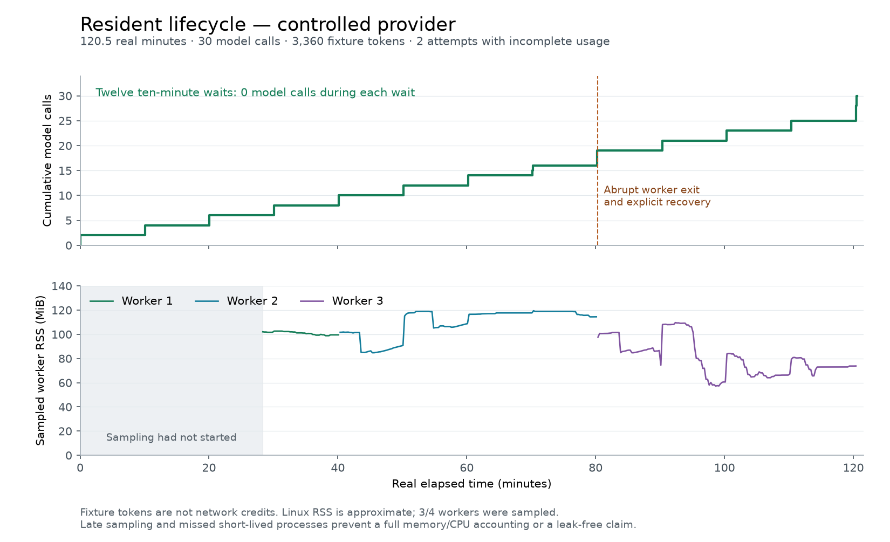

# Resident lifetime accounting and sustained lifecycle audit

Status: implementation and bounded audits complete. The sustained lifecycle
ran for 2 hours 32.851 seconds; its independent record audit passed on 2026-09-14.

The experiment starts from production commit `0a362604`. Its purpose is to make
resident execution explainable across process boundaries: which claims were
admitted, which decisions were durably settled, which completions have scoped
verification receipts, and how much usage remains known or unknown after an
interruption. This is not a consciousness experiment or a provider billing test.

## Primary sources and design consequences

The Pydantic AI Harness source was read at
`c897c4e8bcb7f0e5a8968aaccdb0f8edf42fe504`:

- [`SpendLimits`](https://github.com/pydantic/pydantic-ai-harness/blob/c897c4e8bcb7f0e5a8968aaccdb0f8edf42fe504/pydantic_ai_harness/spend/_capability.py)
  carries counters across runs and distinguishes its pre-request guard from a
  strict ceiling: concurrent requests can pass before their usage is recorded.
- [`BatchSpendStore` and replay tokens](https://github.com/pydantic/pydantic-ai-harness/blob/c897c4e8bcb7f0e5a8968aaccdb0f8edf42fe504/pydantic_ai_harness/spend/_store.py)
  apply all budget windows together. Process-local counters and finite-lived
  deduplication markers have explicit recovery limits. A root receipt reused
  for two resident claims must not silently double the total.
- [Current spend documentation](https://pydantic.dev/docs/ai/harness/spend/)
  was also checked. Namzu's selected change is read-only accounting, without a
  new gate or a claim of atomic lifetime reservation.

[Temporal's event-history documentation](https://docs.temporal.io/workflow-execution/event)
separates activity scheduling, completion and accepted cancellation, and bounds
history size. The applicable lesson is to reconstruct lifecycle facts from
committed transitions, while retaining uncertainty about an executor whose
terminal evidence is absent. Namzu does not implement Temporal's service,
automatic activity retry or exactly-once external effects.

Existing Namzu contracts were read before implementation:
`manager/resident/{agenda,history,history-disk,host,initiative}.ts`,
`run/token-budget.ts`, the scoped Run record, and CLI resident start/finish
receipts. A Run's `tokenUsage` is own usage; `budget.treeTokens` includes
descendants. Summing both would double-count the root. The CLI finish receipt
retains cost, whereas its Run metadata file does not retain that price field.
A missing finish therefore cannot be priced from a Run's token count alone.

## Selected implementation

`DiskResidentAgenda.activity` derives admitted claims and settled decisions from
adjacent immutable revisions, including archived pursuits. The scope's upper
revision stays fixed. Pages bound revision count and bytes and disclose missing
predecessors instead of inferring no activity.

`inspectResidentConsumption` projects host-authenticated root receipts without
writing another counter that could drift after a crash. It keeps own and tree
totals separate, rejects conflicting root identities, bounds total resolution
reads, and exposes missing, deferred, invalid and provisional evidence.
Prices are root-only estimates. Unpriced tokens and unknown receipts are not
free work. The SDK cannot authenticate a custom resolver or recover provider
usage that was never durably recorded.

`namzu resident inspect` is the CLI reader for both foreground and managed
attempts. It uses the current CLI scope, bounded private-file reads, and the
Run's tenant/project/Session/run binding. It never creates a provider or
re-executes an action to obtain a missing receipt. The command distinguishes
historical claim verification from checking today's source bytes.

The implementation is committed locally as `0a0baf25`, with UUID-alias
deduplication in `830f81eb`. A separate numerical correction in `9a4877ac`
scales the selector's mean cost before addition: finite costs near
`Number.MAX_VALUE` previously yielded `Infinity` and serialized as `null`.
Regressions cover large, zero and subnormal costs without changing the default
host selection policy. The sustained producer does not enable that selector.

## CLI fault checks and storage scale

`lifetime-inspect-cli.mjs` copies the closed short-control records and invokes
the actual CLI reader. Seven cases passed: baseline, missing start, missing
finish, a finish copied from another claim, an oversized finish, missing
history, and a fixed partial revision range. The result is retained in
`lifetime-cli-results.json`. Each invocation preserves the copied resident and
Session files, including JSONL evidence. Instrumented JavaScript fetch,
HTTP/HTTPS and socket APIs received no requests. This is a check of the CLI
reader, not an OS network-isolation test.

A missing finish retains the scoped Run's known tokens but loses final-usage
and price certainty. Missing or conflicting authority removes that receipt's
known contribution and increases the unknown count. Missing history prevents a
lifetime-completeness claim. These cases never replay a resident action to
recover its output.

`lifetime-scale.mjs` uses fresh disk agendas, in-memory synthetic receipts and
an explicitly injected scheduling clock. Elapsed performance still uses the
real monotonic timer; it is not the sustained lifecycle test. The retained
`lifetime-scale-results.json` records:

| Admissions | Revisions | Full inspection | 128-revision pages | History bytes read |
| ---: | ---: | ---: | ---: | ---: |
| 128 | 259 | 170 ms | 3 | 213,322 |
| 512 | 1,027 | 654 ms | 9 | 851,827 |
| 1,024 | 2,051 | 1,284 ms | 17 | 1,709,533 |

The bounded default stops at revision 256 and reports a continuation cursor;
it does not silently label its 127 admitted attempts a lifetime total. Full and
paged claim sets and own-token totals agree for these fixtures. This comparison
does not establish arbitrary cross-page deduplication or settlement joining.
The RSS fields cover the whole benchmark process, including fixture generation
and earlier cases, rather than isolated inspector allocations. Results come
from one local run; there is no cross-machine performance guarantee.

The first scale fixture used `wakeAt == now` and was correctly refused by the
runtime, which requires a future wake time. That failed fixture remains at
`/tmp/namzu-lifetime-scale-Q8Xv9C`; the corrected run is
`/tmp/namzu-lifetime-scale-HxOFkQ`.

## Controlled lifecycle method

`lifetime-soak.mjs` runs actual CLI commands and actual managed worker processes
against an isolated, built detached checkout of `0a362604`. Only provider
construction is replaced by an explicit local mock. The operator state and
workspace live below a unique `/tmp/namzu-lifetime-soak-*` directory.

The default schedule has twelve ten-minute idle intervals, two pursuits, a
clean worker replacement, an abrupt SIGKILL of the probe's own sleeping worker,
explicit inspected release/reconciliation, graceful cancellation, verified
completion and archival. Successful scripted replies each report 120 total
tokens, including cache buckets already contained in that total. These are
fixture units, not network inference or credits. Idle intervals must add zero
model requests. Interrupted replies lack final usage and remain unknown.

The script has a shorter timing option for checking its own mechanics. That
short run is not the sustained result. The first short run failed a probe
assertion that accidentally included the final completion in an earlier epoch's
wake-input check; the filter was corrected to select waiting replies only.
Its failure is retained at `/tmp/namzu-lifetime-soak-O4Ljlz`. The corrected
41.072-second control at `/tmp/namzu-lifetime-soak-NooJeb` passed with 30
admissions, 29 finish receipts, four worker PIDs, two verified completions and
two archived pursuits. Both interrupted admissions remain incomplete for usage.

The sustained run, `/tmp/namzu-lifetime-soak-1U3CYt`, ran from
2026-09-13 16:12:15.138 UTC to 18:12:47.989 UTC: **7,232,851 ms** of real elapsed
time. Its fixed production checkout remained clean and its six measured build
fingerprints matched before and after. The new inspector read the records after
the producer stopped; hashes of the resident and Session files, including JSONL,
matched before and after inspection. `lifetime-results.json` retains the scoped
records, lifecycle transitions, build hashes, source hash and independent audit.

| Observed fact | Result |
| --- | ---: |
| Admitted claims / provider stream entries | 30 / 30 |
| Worker processes across restarts | 4 |
| Ten-minute idle intervals / calls during those intervals | 12 / 0 |
| Successful replies / retained fixture tokens | 28 / 3,360 |
| Finish receipts | 29; abrupt death has none |
| Interrupted attempts with incomplete usage | 2 |
| Completions with recorded claim verification | 2 |
| Archived pursuits / consumption retained | 2 / 3,360 tokens |

After the clean restart, the same pursuits consumed subsequent accepted inputs.
After the abrupt kill, the exact worker owner was released and its unresolved
claim was inspected and reconciled. Graceful cancellation retained a finish
receipt with no decision, no final usage and confirmed cleanup; its exact claim
was then reconciled. Both reconciliations chose waiting, not completion. The
final worker used its admitted verification-policy snapshot even after the
on-disk manifest was changed to an invalid new version. No fixture claim was
automatically re-executed to fill missing consumption.



A separate read-only `lifetime-resources.mjs` observer samples the probe's own
worker after checking its working directory and recording process-start ticks. Sampling
began after lifecycle startup; short-lived workers may be missed. CPU ticks and
peak RSS are cumulative within an observed process. [Linux's procfs documentation](https://docs.kernel.org/filesystems/proc.html)
notes that RSS counters are asynchronous and approximate, so these are
kernel-reported operational measurements, not exact heap size or a proof of no
memory leaks. No process is signalled by the observer.

`lifetime-resource-results.json` retains 369 samples of three of the four
workers. Sampling started 28.35 minutes into the run and missed the short final
worker. The highest sampled RSS was 119.47 MiB; the highest reported historical
peak was 146.94 MiB. The last cumulative CPU observations were 10.16, 10.44 and
10.57 seconds for the three sampled workers. These are incomplete process
measurements, not total experiment CPU, and the result does not establish a
memory-leak bound. `lifetime-overview.svg` is the exportable vector plot.

## Bounded real-model supplement

Two isolated foreground CLI trials used `codex/gpt-5.6-luna`, effort `low`,
maximum eight iterations and 24,000 tokens per admitted step:

| Trial | Real model requests | Scripted replies | Recorded tokens | Result |
| --- | ---: | ---: | ---: | --- |
| Current version | 2 | 0 | 9,561 | Scoped verification and complete |
| Incorrect first proposal, then repair | 2 | 1 | 9,719 | Rejection feedback, permitted read, verified correction |

Raw evidence: `/tmp/namzu-claim-live-W7I4OM` and
`/tmp/namzu-claim-live-SI40rh`. Their producer fingerprints stayed stable; neither
reported an execution failure. The combined real usage is 19,280 tokens. Pricing
is unavailable, so there is no claim of zero billable cost. This small sample
checks the integration; it is not a benchmark of broad model intelligence or
long-horizon live inference. The repair's first incorrect proposal is
intentionally scripted, not attributed to Luna.

A third trial used the actual managed CLI launcher and background worker from
the built `0a0baf25` checkout, without scripted model replies:
`lifetime-managed-live.mjs --live` (pass the checkout before `--live`). The
worker made two Luna/low model calls, recorded 9,531 tokens, used the read tool,
verified version `7.0.0`, and stopped after its one authorized admission.
Its inspection retained final usage and historical verification; the fixture
file and inspected records were unchanged. A ten-second post-stop observation
recorded no additional calls. The full local experiment took 17.939 seconds;
this is not another sustained run. Curated evidence is in
`lifetime-managed-live.json` and the raw record is
`/tmp/namzu-resident-managed-live-a17rPN`.

Across all three live supplements: six real model calls, one deliberately
scripted rejection seed, and 28,811 recorded tokens. Provider HTTP retries are
not separately counted by the stream-entry observer. All recorded tokens are
unpriced, so no monetary total is inferred.

## Validation and reproduction

Implementation checks passed: workspace typecheck, build and lint; the final
SDK suite (6,825 tests); CLI suite (3,052 passed, five existing skips); all SDK
process tests (266); SDK coverage floors; documentation conformance and 50
compiled TypeScript fences. Lint retains 15 existing CLI warnings. The other
workspace package suites, evaluation suites, workflow/reference checks,
external-name and log audits, price-catalogue check, publish metadata, signature
exports and test-presence checks also passed.

A detached `0a0baf25` checkout passed the packed consumer install checks and
publint 0.3.24 for all 20 publishable packages. Those packaging checks cover the
feature commit; the two subsequent SDK corrections changed no package metadata
or dependency. The installer parsed with both `sh` and an isolated Arch dash
0.5.13.4 binary extracted under `/tmp` because dash was not installed. No package
version was changed and nothing was pushed or published.

The UUID-alias and overflowing-cost bugs were first reproduced as failing
tests. Probe setup failures are retained too: the first short soak assertion
used the wrong completion filter; the first scale fixture supplied a nonfuture
wake time; an initial root-level formatter selected the wrong configuration;
and a first publint invocation overlapped a build clearing its output directory.
The formatter was rerun from the SDK package, lint passed, and packaging was
checked against the separately built, inactive consumer checkout. None of those
failed attempts is counted as passing runtime evidence.
`lifetime-validation.json` retains hashes and excerpts of 19 validation logs
and six failed development attempts, so the report preserves failed controls
alongside the final successful results.

From a built checkout, the retained records can be checked without model calls:

```bash
node --test research/resident/lifetime-audit.test.mjs
node research/resident/lifetime-audit.mjs /tmp/namzu-lifetime-soak-1U3CYt /tmp/namzu-lifetime-recheck.json
node research/resident/lifetime-resource-audit.mjs /tmp/namzu-lifetime-soak-1U3CYt /tmp/namzu-resource-recheck.json
```

The first command uses committed evidence; the other two require the original
local raw records. A fresh lifecycle run uses
`node research/resident/lifetime-soak.mjs /absolute/path/to/fixed-built-checkout`
and intentionally takes at least two hours. `NAMZU_SOAK_INTERVAL_MS=1000` is
only a short probe control and cannot satisfy the sustained audit. The real
model supplements require explicit `--live`; re-auditing their retained records
does not send model requests. Plot reproduction uses
`uv run --with matplotlib python research/resident/lifetime-plot.py`.

## Limits and next autonomy milestone

The full history is still retained in immutable revision files. This work adds
bounded reading, not physical compaction, a database index or indefinite
constant-time lifetime totals. A byte-limited scan and a page beginning after
revision 1 remain partial. Historical receipt inspection can observe evidence
published after the selected agenda revision; it is not a historical wall-clock
snapshot. Malformed or unavailable records remain explicit uncertainty.

No new outbound communication, personal-resident mutation, OS service, external
account action or publication is authorized by this test. Completion claims
still need an explicit host verification policy. Resource observations do not
make the model generate useful independent goals by themselves.

The next autonomy milestone is an explicit CLI host policy for selecting among
existing authorized pursuits using observed progress and a consistent resource
unit, with explanations for wait/stall/unknown-cost decisions. The SDK selector
already rejects missing observations and unknown costs. Connecting that policy
to verified outcomes needs separate evidence; a token total alone is not a
measure of useful progress. A lifetime spending gate would additionally need
atomic reservation, retained uncertainty and a policy for unpriced work.
