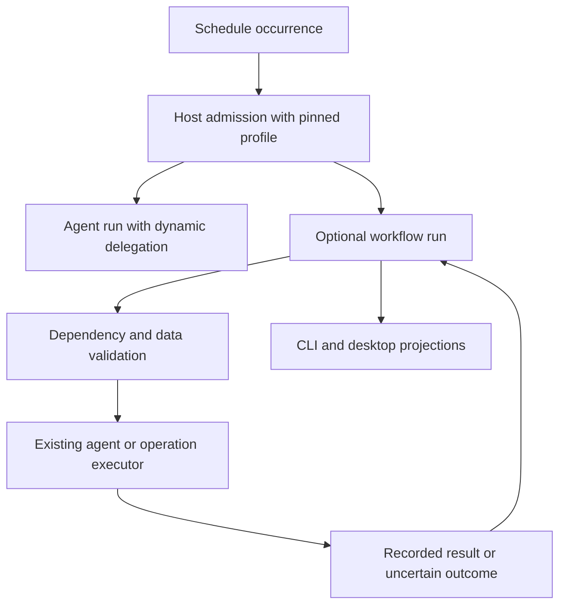

# Orchestration decision — 2026-10-01

Status: architecture selected for implementation planning. No new runtime,
workflow API, schedule target or live job is implemented by this document.
Namzu source baseline: `1af4531a1b18c4386aa672ef2bfa7f83980af07c`.
The operator delegated the architectural choice and explicitly asked whether the
request itself misidentifies a capability Namzu already has.

The subsequent Pal/group/lead requirement is resolved in
[`PALS-ARCHITECTURE.md`](PALS-ARCHITECTURE.md): reusable identities and deployments,
resource grants, group roles, optional continuity and an audited A2A boundary.
It records a concrete mismatch between the current A2A bridge's declared version
and emitted wire contract; remote interoperability remains an implementation gate.

## Decision

Retain the existing agent/delegate execution foundation. Add saved host-owned
execution profiles for repeated multi-provider delegation. Add an opt-in durable
workflow layer for work whose dependencies, output contracts and recovery must
be enforced independently of a model's choices. Ordinary conversations and
agentic delegation do not become fixed graphs by default.

Use a bounded local workflow state machine for the default single-machine
operator application. Keep a store/executor boundary through which a mature
external durability engine can supply stronger deployment guarantees. Do not
claim a new local controller is equivalent to a distributed workflow service.

This choice follows the required guarantees and deployment boundary. There is
no single industry-certified "gold" architecture for every agent application;
familiar terminology does not establish its correctness. The acceptance gates
below, including interruption and admission evidence, establish our claims.

## Interpret the request before choosing a mechanism

| Actual requirement | Appropriate mechanism | Namzu today |
| --- | --- | --- |
| Ask several specialists on different models, combine their answers | Agentic delegation with fan-out/fan-in and bounded parent ownership | Already supported by child model/provider selection and coordinator/delegate execution |
| Let a coordinator decide what subtasks are needed each time | An agent run using the existing delegation tools | Already supported; a predefined DAG would restrict this unnecessarily |
| Repeat such a task on a timer with the same allowed roles/routes | Schedule an agent run using a saved execution profile | Schedule and delegation exist; the headless route does not retain a multi-provider role profile |
| Enforce A, then parallel B/C, then D; retain completed steps across interruption | Durable workflow orchestration | Plan dependency helpers exist; enforced durable run admission/recovery does not |
| Continue one open-ended objective when new evidence arrives | Resident pursuit with explicit wake/admission | Opt-in resident prototypes exist; this is a different lifecycle from fresh cron occurrences |
| Keep a development server running while the agent works | Managed background process | Already supported; it is not a recurring multi-agent workflow |

An "AI" is not necessarily a separate executing agent. A provider/model route
selects inference; an agent binds that route to tools, instructions and execution
ownership. An external agent service is a delegate with its own transport and
capabilities. A group is reusable membership/role configuration. A Pal is a
separate reusable agent identity; neither concept requires permanent processes
or a new supervisor class in the SDK.

Cron starts distinct occurrences. It does not advance a graph by asking a model
to inspect task states on every tick. Each occurrence gets fresh run state;
cross-run business state is explicit input/artifact data. Resuming an interrupted
occurrence and starting the next occurrence are different operations.

## Existing code: strengths and precise limits

- `cli/integrations/subagents/runtime.ts` accepts a separate child provider/model,
  dynamic persona and file-defined agent type. Its default route inherits the
  invoking turn. Existing tests verify the actual selected provider receives the
  request and the parent provider does not receive it instead.
- `sdk/scheduler/delegating.ts` adapts foreign delegates to the same scheduling
  surface. Their result is the remote party's declared outcome, not an
  independently authenticated side-effect receipt. Capability declarations
  alone do not supply durable lookup or idempotent dispatch.
- `sdk/tools/coordinator/plan-dependencies.ts` resolves dependency descriptions,
  detects ambiguous references/self-dependencies/cycles and keeps edges for plan
  approval. `PlanManager.getNextPendingStep()` evaluates readiness. The inspected
  production tree does not call that helper to enforce every launch;
  `create_task` records a step's running/outcome state directly. These are useful
  host extension points rather than a complete enforced workflow executor.
- `PlanManager` keeps its current plan in memory. Session events can retain
  evidence, but a newly constructed manager does not restore a plan or resume
  workers. Do not confuse a log of an execution with an executable checkpoint.
- `TaskStore` persists task/dependency records. Its `claim()` checks pending and
  ownership, not prerequisites. `DiskTaskStore`'s lock map is per instance, not
  a multi-process workflow lease. Preserve this tracking API; do not silently
  change its semantics to impose a new workflow scheduling policy.
- `PlanManager` considers a skipped predecessor resolved. This can be correct
  for an interactive plan. A workflow join must separately define whether it
  requires success, a selected branch or any settled outcome; copying that
  predicate would lose this distinction.
- `schedule/fire/fire.ts` passes one detected provider into session construction.
  The child route resolver in `tui/agent.ts` uses that detected list. It does not
  supply a saved multi-provider team. The presence of `subagents.active: []`
  alone is not proof that child execution is disabled: no current production
  reader of that preference was found, and the Agent tool remains constructed.
- Resident state, exclusive admission and exact-claim settlement are useful
  precedents. Their documented unresolved-claim policy avoids blind replay.
  Do not put a workflow graph into an 8,000-character resident summary or create
  two independent authorities for the same running work.

`orchestration-boundary.mjs` runs the built public SDK against its own temporary
state. It observes ready step A while a direct update can mark dependent B
running; a fresh plan manager has no active plan. A reopened task store retains
the dependency even though B was claimed while A was pending. The receipt is
`artifacts/orchestration-boundary.json`. These are observed contract limits,
not claims that generic status-reporting APIs are defective.

## Terms and ownership

| Term | Meaning here | Owner |
| --- | --- | --- |
| Agent run | One bounded execution with model/tool iterations and child ownership | Existing SDK agent runtime |
| Execution profile / role binding | Versioned host configuration of agent type, provider/model, tools, roots and limits | CLI/desktop composition; no tokens persisted |
| Workflow definition | Versioned control/data contract describing steps and their dependencies | SDK validation/semantics; host stores definitions |
| Workflow run | One execution of a pinned definition and inputs | One authoritative workflow controller |
| Step | Logical work and validated output within a workflow run | Workflow state machine |
| Attempt | One execution try for a logical step | Executor adapter, linked to actual task/session/effect evidence |
| Activity / operation | Work that performs model, tool or external I/O | Existing runtime/executor or external durability adapter |
| Schedule occurrence | One due instant admitted or explicitly skipped | Existing schedule service |
| Pal / group / lead | Reusable agent identity, membership and assignment coordination role | Host composition; see the Pal decision |
| Mission | Operator-facing objective | Application presentation |

These are design terms, not newly exported TypeScript names. "Task scheduler"
in the current SDK is a dispatch/capacity abstraction. Cron is time-based
triggering. Dependency orchestration belongs to the workflow controller. Avoid
renaming working exports just because one term is used differently elsewhere.

The two execution modes share policies, logs, budgets and providers. Each mode
has one control authority. The UI is observational; neither a UI task list nor
model-written memory can authorize another step.

## Required execution contract

1. **Identity and immutable versions.** A schedule occurrence identifies one
   run; run/step/attempt are distinct. Pin graph/profile/schema/executor
   compatibility revisions. Definition edits apply to later confirmed runs.
2. **Pure control, recorded nondeterminism.** Readiness, joins, cancellation and
   outcomes depend on recorded state. A model's branch/plan choice is validated
   and recorded before execution. The agent inside a step may still decompose
   its bounded work dynamically. No arbitrary replay of a JavaScript closure is
   promised by a serialized DAG.
3. **Guarded admission.** Check prerequisites in the same fenced run transition
   that writes dispatch intent. Capacity and budget have their existing owners;
   retain owned reservation references and reconcile their release after an
   interrupted launch instead of claiming a filesystem transaction across all
   stores. Revalidate current authority and cancellation at actual admission,
   including after a capacity wait. Required output validation precedes success
   and downstream release. Waiting for a provider does not rebuild the plan or
   erase completed steps.
4. **Capability-aware recovery.** Existing `TaskScheduler.createTask()` does not
   accept an idempotency key or require durable lookup. A durable adapter must
   declare and prove its dispatch/lookup/reconciliation contract. Until then,
   unresolved launch or external effects remain uncertain, with no blind retry.
   A state fence prevents stale state commits; it cannot undo an external write.
5. **Structured child ownership.** A run cannot succeed while required children
   or effects are unsettled. Cancellation joins actual cleanup or records its
   unresolved state. Optional detachment requires a separate owner and delivery
   contract, not dropping the handle when the parent exits.
6. **Explicit outcomes.** Success, failure, cancellation, not-selected/skipped
   branches and uncertain effects stay distinct. Retry policies classify errors
   and impose finite attempt/time/token limits. Shared budgets include descendants.
7. **Explicit recurrence.** Keep current skip-while-running as the initial
   overlap policy. Preserve time zone, catch-up and clock-skew evaluation. Record
   skipped occurrences. Queueing, replacement and concurrent runs need explicit
   limits and different verification.

## Persistence and deployment choice

Default scope is a bounded single-machine controller, with one run owner and an
authoritative immutable revision containing its step state and dispatch intents.
Use the existing revision/CAS primitives where their actual guarantees satisfy
this contract. Large tool transcripts and artifact blobs remain in their current
stores and are referenced; projections do not become parallel authorities.

The filesystem implementation must prove atomic admission, process interruption,
stale-owner refusal and launch/result reconciliation. Record separately whether
storage acknowledgement survives power loss. Atomic rename/hardlink or a lease
does not, on its own, establish distributed transactions or external-effect
deduplication. A transactional backend remains possible behind the store seam;
the storage choice must not leak through provider or agent APIs.

If the required deployment is multiple workers/machines, automatic failover and
operationally managed long-lived workflows, select an established durability
engine through an optional adapter. Do not rebuild that service inside the
default local CLI, and do not advertise those guarantees for the local runner.
Neither a database dependency nor a framework name alone grants those guarantees.

## Why this choice, from the inspected sources

The pinned evidence is linked in `RECURRING-MISSIONS.md`:

- Pydantic Graph supplies explicit fork/join semantics; its durability capability
  separately wraps model/tool I/O in engine activities. This supports separating
  composition from durability instead of adding a mandatory supervisor agent.
- Temporal exposes schedule overlap separately from workflow replay and activity
  execution. The replay API detects incompatible histories. Reusing its terms
  is useful; a local checkpoint implementation is not its replay engine.
- Inngest's checkpoint engine makes stable step identities and recorded results
  central, while relying on its backend to persist them.
- Hermes integrates finite-session child joining and a separate durable cron
  attempt ledger. Its God mode race does not demonstrate dependency execution
  or durable workflow recovery. Its ledger explicitly is not a retry queue.

For Namzu, adding a kernel-mandated Team/Supervisor class would duplicate current
delegation and put application policy into the SDK. Making every task a static
DAG would reduce adaptive execution. Using only a prompt and task list cannot
enforce restart, dependency and effect guarantees. A separate distributed service
as the default would impose deployment cost unsupported by the current local
requirement. The selected modes address these different needs explicitly.

## Delivery order and acceptance gates

1. Specify and verify a saved host execution profile using existing file-defined
   agents and routes. Test a scheduled run on two actual selected provider
   bindings, no silent fallback, and unchanged standalone/script job semantics.
   This supplies routine agentic teamwork without requiring a workflow graph.
2. Add optional bounded workflow definitions and pure validated transitions.
   Reuse dependency validation where appropriate; do not turn PlanManager or
   the generic TaskStore into a second durable controller.
3. Add guarded run persistence and executor capabilities. Inject interruption
   before dispatch, after launch and before result commit; verify uncertain
   effects cannot be replayed automatically. Refuse stale owner settlements.
4. Expose the same run projection in schedule/TUI/desktop. Link real sessions,
   attempts, costs, approvals and output artifacts rather than inferred states.

Required proof: A -> (B || C) -> join -> D; blocked D never launches, output
validation gates release, failed/skipped branches obey the declared policy,
restart retains completed B and C, and duplicate occurrence admission cannot
launch a second run. Exercise actual mixed-provider execution, partial failure,
stop/cleanup, route unavailability, shared budget, clock/DST/overlap and definition
editing. Runtime state/effect evidence must corroborate the final answer.

## Checks for this assessment

The public SDK probe performed no inference and changed only its own temporary
task state. Four existing SDK files passed 54 tests covering dependency
validation, reported plan outcomes, foreign delegate dispatch and plan
settlement. The CLI test invocation actually ran the full suite, despite the
requested file arguments: 510 files and 4,665 tests passed, with 5 existing
skips. This includes child model selection and file-defined agent tests. Actual
commands, exit codes and suite summaries are recorded in
`artifacts/orchestration-validation.json`. These use scripted providers; they
do not establish live mixed-provider workflow recovery or peer runtime results.

The implementation sequence is selected; its claims remain subject to these
gates. This decision does not represent a delivered industrial durability engine.
