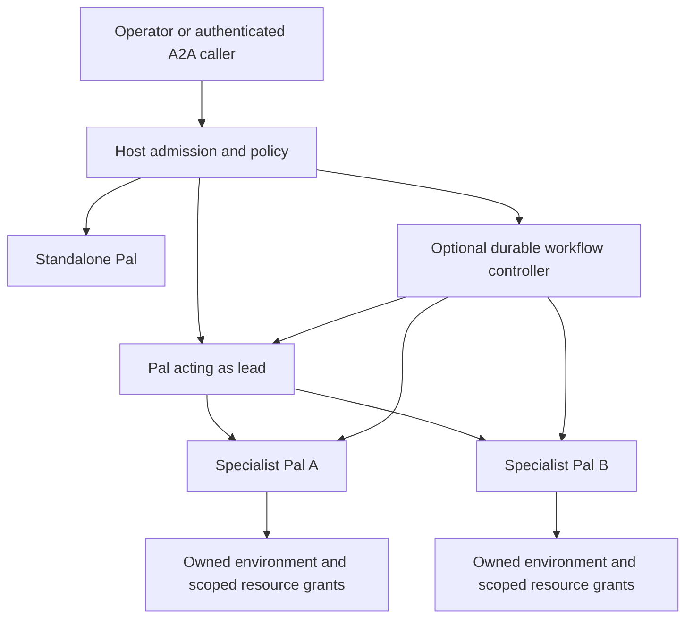

# Pals: reusable agents, groups and execution ownership

Decision date: 2026-10-01. Status: selected architecture, not an implemented
Pal product or a promise of protocol interoperability. Namzu source baseline:
`1af4531a1b18c4386aa672ef2bfa7f83980af07c`.

The operator clarified that agents should be individually useful, reusable
across missions and optionally grouped, with their own browser/environment and
credential access. This supplements [the orchestration decision](ORCHESTRATION-DECISION.md).

## Product decision

Use **Pal** for an operator-owned, reusable agent identity. A Pal can work alone
or participate in multiple groups. Its definition binds instructions, an agent
implementation, model routing, tools and limits; the host controls its authority.
The existing SDK Agent contract remains the execution foundation. Pal is a
product concept, not a required replacement for `Agent`, `runAgent` or `Delegate`.
Keep application storage scope separate: a tenant, project or topic is required
only where a chosen host/store contract needs it, not to make an agent a Pal.

Do not define a Pal solely as an agent with a sandbox. Environment isolation is
an independently selected deployment property. A Pal can use a granted local
device, an isolated remote environment or no computer tools at all. A plain SDK
agent need not have a persistent product identity.

The operator's Dots reference is current. The official product describes a
cloud computer/browser, continuity between conversations, memory and background
work with wake/pause behavior. It also separates local-device connections and
app permissions. This motivates separate identity, continuity and environment
contracts; it is not evidence that Namzu already delivers that lifecycle.
[Official Dots documentation](https://learn.chatgpt.com/docs/dots).

## Distinct concepts

| Concept | Responsibility | Lifetime / authority |
| --- | --- | --- |
| Pal identity | Stable operator-facing name and ownership | Survives runs; host-owned identifier |
| Agent definition | Instructions, implementation, tools and routing configuration | Versioned; executable code is not serialized in a prompt |
| Pal deployment | Binds identity and definition to a host, state stores and authorized resources | On demand by default; resident operation is explicit |
| Environment lease | Owns a device/container/VM/browser attachment | Separately acquired, fenced and released |
| Credential grant | Allows a principal to use a particular account for bounded actions | Host-enforced, revocable; group membership grants nothing by itself |
| Group | Reusable membership and role bindings | Configuration; no implicit shared memory or permission union |
| Lead | Coordinates delegated work for a particular assignment | Optional role assumed by a Pal, not a distinct agent class |
| Assignment / agent run | One admitted task for a Pal with explicit inputs and scope | Bounded execution; sessions and attempts are separate records |
| Workflow run | Enforces selected dependencies, joins and recovery | Optional deterministic controller, independent of model prose |
| A2A endpoint | Exposes an authorized delegation interface | Protocol adapter over a Pal or lead; not its runtime owner |

Group roles can override routing within the Pal's allowed policy. Pin resolved
definition and assignment revisions at admission. Editing a group or promoting
a different lead must not alter the authority of an already running assignment.
Two groups assigning the same Pal must follow its concurrency/resource policy;
membership does not create a duplicate execution owner.
Keep Pal memory separate from assignment context and group-shared artifacts.
Sharing is an explicit scoped reference or publication; changing membership
does not merge private histories, credentials or learned preferences. Personal
state, run history and shared outputs have separate retention policies.

## Lead and orchestration

A lead Pal may choose specialists, fan out independent work and combine their
results using current delegation. This is the default adaptive mode. An explicit
workflow is needed only when dependencies and recovery must be enforced even if
the model chooses differently.

Do not add both a lead model and a second orchestrator model with the same
planning responsibility. In a workflow, the controller performs mechanical
admission, persistence and joins; a lead's bounded planning task can provide a
validated decision to it. Hierarchical groups are permitted only with bounded
delegation depth, descendant budgets, cancellation and cycle prevention. There
is no need to start with a general hierarchy for the first reusable-Pal slice.

This illustrates supported composition choices, not simultaneous competing
controllers for one run. The host admits the requested mode and retains one
control authority. A2A callers interact with the lead's declared service; they
need not discover its child graph or access child credentials.

## Environment, browser and credentials

Use existing sandbox providers for execution isolation. A Git worktree isolates
checkout state, not operating-system access. Kubernetes is the provisioning
mechanism; the actual runtime boundary depends on its configured RuntimeClass.
Do not advertise VM isolation merely because a deployment is on Kubernetes.
Logical host scope checks are not an OS boundary against arbitrary shell code.
If a Pal can execute code, the environment and mounted resources must enforce
the advertised isolation; a per-Pal directory alone cannot do so.

Keep Pal-owned state separate from environment lifetime. Pin which state may be
restored, and reacquire authority before resuming it. A snapshot can contain
signed-in browser state and must inherit its owner's access and retention rules.
Remote persistence is not proof that work continues after the local host exits.
Always-on operation needs an available service host, explicit wake sources and
restart reconciliation. The existing resident experiment is a useful separate
foundation, not a daemon supplied by every ordinary agent run.

Allocate browser profiles explicitly per Pal/account grant. A profile name or
CDP connection is not a VM boundary. The current Windows browser leases share
one browser across processes on the same profile, so they do not establish
exclusive Pal control. Default independent Pals to separate profiles; any shared
account/device requires an explicit ownership lane that serializes conflicting
actions. Provision browser/computer-use tools against the selected environment
instead of accidentally attaching to the operator's host browser.

Persist credential references and grants rather than raw secrets in Pal/group
definitions. Provider credentials and third-party application credentials are
different resources. Resolve them in host code for approved destinations/actions;
use a broker or protected host tool where possible. Never put raw credentials in
model instructions, task artifacts or ordinary A2A messages. A secret injected
into a guest is visible to guest code, including agent-written code; encryption
at rest does not change that runtime exposure. A signed-in browser can still
perform account actions, so keep action and destination checks after connection.

The official sandbox and environment guidance supports separating agent
configuration, execution environments, durable sessions and protected external
credential use. Our host composition must enforce those boundaries independently.
[Sandbox guide](https://developers.openai.com/api/docs/guides/agents/sandboxes),
[Agents API resources](https://developers.openai.com/api/docs/guides/agents-api/overview),
[Environment security](https://developers.openai.com/api/docs/guides/agents-api/environments/security).

## A2A: audit before exposing a lead

Namzu already exports agent-card/task/event mappings, context resolution and an
A2A delegate client. These are useful seams, not proof of a conformant hosted
service. The mappings do not themselves authenticate an HTTP request or apply
per-caller task authorization. A card's bearer declaration is not enforcement.

There is a concrete version mismatch, beyond a missing Pal composition layer:

- Namzu advertises `0.3.0`. The pinned official `v0.3.0` schema requires message
  `kind` and `messageId`; `messageToA2A()` emits neither.
- Its official task states include `submitted` and `working`; Namzu emits
  `pending` and `running` for queued/running turns.
- Its official AgentCard requires `url`. Namzu instead emits
  `supportedInterfaces` and `securityRequirements`, neither a declared card
  property in that schema; the standard security declaration is `security`.
- The currently inspected official repository describes the 1.0 protocol and
  breaking changes. Changing the version string would not fix this wire shape.

The public SDK probe `a2a-contract-boundary.mjs` checks selected requirements
against the pinned schema excerpt and records these differences in
`artifacts/a2a-contract-boundary.json`. This is a reproducible partial comparison,
not full schema validation or a live remote-peer test. Existing unit tests that
expect Namzu's own shapes cannot establish protocol interoperability.

Before releasing a Pal A2A endpoint, select the current 1.x binding as the target,
audit it against the actual official schema and SDK, and prove external-peer
interoperability. Keep a deprecated compatibility adapter for current public
exports if migration requires it; follow minor/deprecation and later major
removal policy rather than silently changing existing callers' wire contracts.
Changing a default binding or incompatibly changing a public wire shape needs
a major release even if the new shape corrects a protocol defect.
Version negotiation must refuse unsupported bindings instead of guessing.

The hosted boundary must authenticate each request, scope task/context/artifact
access to the caller and gate cancellation separately. Advertise business
capabilities rather than automatically exposing every internal tool. A lead's
authority to delegate does not let a caller inherit a specialist's account grant.
Compute effective assignment authority from host policy, Pal grants, assignment
limits and the caller's delegated purpose. A provider/model switch grants no
extra tools or account access. Authenticated peer prose is still a claim;
validate artifacts and obtain effect evidence before reporting external work done.
Track task identity, input/auth-required pauses, terminal states and remote
cancellation outcomes without claiming a local disconnect stopped remote work.
The existing delegate result has no input-required continuation channel; extend
that contract deliberately where interactive peers require it.
The current mapper equates an A2A task with one turn. A long-lived workflow
endpoint needs a task mapping to its authoritative run and artifacts; intermediate
planning-turn completion must not falsely complete the externally requested task.

Primary repository evidence:
[0.3 schema](https://github.com/a2aproject/A2A/blob/210f03d426e2f2fa92000e14ef0de3b7ba15aee5/specification/json/a2a.json),
[current specification, authentication and access scope](https://github.com/a2aproject/A2A/blob/1ae57a673f729f743b35f2677f3adc302438695a/docs/specification.md),
[breaking changes](https://github.com/a2aproject/A2A/blob/1ae57a673f729f743b35f2677f3adc302438695a/CHANGELOG.md).

## Delivery sequence and proof

1. Build a standalone, saved Pal on the existing Agent/delegate contracts, with
   explicit identity, definition revisions and independent state ownership. No
   group or sandbox is mandatory; preserve direct SDK execution.
2. Bind environments/browser profiles and credential grants through host-owned
   resource admission. Prove two Pals cannot read or act with each other's state
   and account grants, and concurrent assignments cannot acquire the same
   exclusive device. Revoke a grant during a run and verify subsequent use fails.
3. Repair/version the A2A adapter before enabling remote Pal endpoints. Verify
   real official-peer send, poll, streaming, input/auth-required, cancellation,
   task scoping and incompatible-version refusal. A standalone Pal can be the
   endpoint; exposing a lead additionally tests delegated authority and results.
4. Add group role bindings and optional lead assignments, retaining standalone
   use. Prove mixed-provider routing, scoped artifact sharing, descendant budgets
   and child cleanup. Connect recurrence using the saved host execution profile.
5. Add the optional durable workflow controller described in the orchestration
   decision. Prove dependency admission and uncertain-effect recovery; resident
   hosting is a separate opt-in continuation mode, not an implicit cron feature.

Named root gaps to retain in the implementation plan: headless runs currently
receive one detected provider; workflow launch lacks guarded prerequisites and
durable dispatch lookup; Pal deployments lack a joined resource/grant lifecycle;
A2A's declared version does not match its emitted contract. None is repaired by
renaming a class or adding a Team prompt. This assessment implements no new
deployment, service, credentials, agent lifecycle or live scheduled job.
