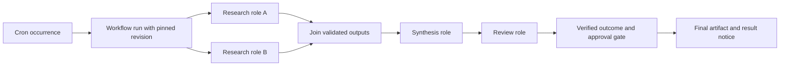

# Recurring multi-provider missions — architecture proposal, 2026-10-01

Status: researched proposal. No mission/team API or recurring graph executor is
implemented by this change. Peer source was cloned and inspected; their services,
agent prompts, optional skills and tests were not executed.

The later requirement review and selected architecture are in
[`ORCHESTRATION-DECISION.md`](ORCHESTRATION-DECISION.md). It distinguishes dynamic
agentic teamwork from enforced durable workflows, corrects the initial broad gap
description with existing plan-helper evidence, and makes a workflow graph opt-in.
The later product identity/group/lead clarification is resolved in
[`PALS-ARCHITECTURE.md`](PALS-ARCHITECTURE.md). Pals remain individually useful;
grouping does not impose a runtime class, sandbox or a permission union.

## Operator requirement

A saved team of different provider/model roles performs one mission repeatedly.
Some work can run together; other work requires upstream results. Every scheduled
occurrence must track its own progress, survive process interruption and report
what actually completed. The operator asked for the architecture to be researched
before implementation, while the desktop correction continues.

## Verified Namzu foundation and gaps

| Existing code | Already supplies | Required addition |
| --- | --- | --- |
| `cli/integrations/subagents/`, `sdk/scheduler/{local,delegating}.ts` | Child execution, provider/model selection, capacity, cancellation, completion and foreign delegate seam | A saved role binding and an authoritative workflow controller |
| `sdk/types/agent/scheduler.ts` | `planId`/`planStepId` correlation and display `workflow`/`phase` annotations | Actual executable dependency edges; display labels do not impose ordering |
| `sdk/tools/coordinator/plan-dependencies.ts`, `sdk/manager/plan/lifecycle.ts` | Dependency resolution/cycle validation, ready-step helper and step outcome reporting | Enforced admission and durable execution/restoration; a helper does not impose every launch's ordering |
| `sdk/store/task/disk.ts`, `sdk/types/task/index.ts` | Durable tasks, `blocks`/`blockedBy`, ownership and atomic record writes | Dependency admission and workflow transitions; `claim()` checks pending/owner, not prerequisite completion |
| `sdk/tools/coordinator/outcome.ts` | Combined task/turn success and failure predicates | Typed node output/artifact validation before releasing downstream work |
| `sdk/schedules/evaluate.ts` | Pure due-time evaluation, claimed-occurrence handling, clock skew, catch-up and skip while a prior run is unfinished | Triggering a saved workflow revision rather than inferring a graph from a fresh prompt |
| `cli/schedule/{store/claims.ts,daemon/daemon.ts}` | Exclusive occurrence claim, fenced daemon ownership, persisted queue, result/session reconciliation and write-folder lanes | Node-level dispatch records and recovery under the same occurrence identity |
| `cli/schedule/fire/fire.ts` | A confirmed headless run, pinned route, permission floor and budget | Host execution profile: session construction receives only one detected provider, so child route resolution does not receive the complete team |

The foundation is substantial. Existing plan helpers already describe and
evaluate dependencies; the missing durable workflow guarantees are enforcement,
restoration, persistence and admission. A schema gives a stable control contract,
but its transitions must also be implemented and proved.
Existing task/session records remain useful; neither a task label nor a cron
entry turns them into a durable dependency executor by itself.

## Pinned source evidence

All URLs below name the exact inspected revision. These are source observations,
not performance or reliability results measured by running the peer products.

| Source | Finding and useful adaptation |
| --- | --- |
| [Pydantic Graph joins](https://github.com/pydantic/pydantic-ai/blob/1748def380cbcf1dc02974a3922cfda63c177563/pydantic_graph/pydantic_graph/join.py), [graph execution](https://github.com/pydantic/pydantic-ai/blob/1748def380cbcf1dc02974a3922cfda63c177563/pydantic_graph/pydantic_graph/graph_builder.py) | Fork-specific joins/reducers make parallel aggregation explicit. GraphRun holds execution state in process; graph syntax alone is not a persistent executor. |
| [Pydantic durability capability](https://github.com/pydantic/pydantic-ai/blob/1748def380cbcf1dc02974a3922cfda63c177563/pydantic_ai_slim/pydantic_ai/durable_exec/temporal/_durability.py) | Durable execution wraps model/tool I/O in activities. Preserve the separation between graph decisions and operations with external effects. |
| [Temporal schedules](https://github.com/temporalio/sdk-typescript/blob/35f5aa38010a559327b48b7b3826d13beca20e81/packages/client/src/schedule-types.ts), [workflow API](https://github.com/temporalio/sdk-typescript/blob/35f5aa38010a559327b48b7b3826d13beca20e81/packages/workflow/src/index.ts), [replay](https://github.com/temporalio/sdk-typescript/blob/35f5aa38010a559327b48b7b3826d13beca20e81/packages/worker/src/replay.ts) | Schedule overlap is an explicit policy. Workflow replay and activity boundaries are distinct from the schedule that starts a run. |
| [Inngest execution engine](https://github.com/inngest/inngest-js/blob/269efeafbad87087d716d682c70428d25aa2dcc9/packages/inngest/src/components/execution/engine.ts), [parallel checkpoint regression](https://github.com/inngest/inngest-js/blob/269efeafbad87087d716d682c70428d25aa2dcc9/packages/inngest/src/test/integration/checkpointing/resumeAfterParallelism.test.ts) | Stable step identities and recorded results distinguish replay from a new execution. The regression covers sequential work, a parallel join and further sequential work. SDK state is supplied by its backend; copying the SDK does not supply that backend. |
| [Hermes delegation](https://github.com/NousResearch/hermes-agent/blob/12e4d3e2dd5281adf289f70e5d6c7f33427d6982/tools/delegate_tool.py), [execution ledger](https://github.com/NousResearch/hermes-agent/blob/12e4d3e2dd5281adf289f70e5d6c7f33427d6982/cron/executions.py), [occurrences](https://github.com/NousResearch/hermes-agent/blob/12e4d3e2dd5281adf289f70e5d6c7f33427d6982/cron/occurrences.py) | Parallel children are joined in finite/cron sessions, which cannot receive detached results after exit. A separate SQLite attempt ledger records immutable terminal outcomes and uncertain attempts. This is useful ownership/reconciliation evidence, not proof of a general DAG executor. |
| [Hermes God mode race](https://github.com/NousResearch/hermes-agent/blob/12e4d3e2dd5281adf289f70e5d6c7f33427d6982/optional-skills/security/godmode/scripts/godmode_race.py) | The optional prompt skill includes parallel model races and response selection. The inspected module does not implement persisted mission dependencies. Its prompt templates were not installed, run or adopted. |

A separate search found `wildanibnthahaa/hermes-godmode` at
`8c0dc0d49298568100b6b26d0fd856d1ec497f6a`; its README describes memory/config
restore and synchronization. It is not the workflow reference used here. The
operator may have seen another project using the same name.

## Assessment for Namzu

Namzu's kernel/application split, provider and delegate interfaces, existing
session logs and schedule ownership are useful foundations for a reusable SDK.
Keep those boundaries when adding workflow execution; a desktop client should
consume the same authoritative state rather than run a second coordinator.

Hermes currently supplies a more integrated operator flow for scheduled child
delegation: finite/cron sessions join their children and its execution ledger
records attempts and uncertain outcomes. Namzu's current headless route does not
retain the configured multi-provider team, so it is less complete for this use.
That is a source-based assessment of this specific flow, not a general quality
ranking or a measured reliability comparison.

For durable dependent recurring teams, neither Namzu's display grouping nor the
inspected God mode race script supplies the required workflow contract. The
recommended next step is to review this plan, then add explicit dependency and
recovery semantics over Namzu's existing execution foundation. The operator's
desktop correction is complete. The operator subsequently delegated the
architectural choice and asked whether the demand itself was misidentified; the
selected modes and their rationale are recorded in `ORCHESTRATION-DECISION.md`.

## Proposed architecture



### 1. Definition, occurrence, run, node and attempt are distinct

- **Team definition:** named roles with provider/model binding, tool policy,
  workspace policy and per-role budget. It describes reusable configuration,
  not a group of permanent running processes.
- **Workflow definition:** stable revision, typed inputs/outputs, node IDs,
  role references, prerequisite edges, join/failure/retry policy and run limits.
- **Schedule:** existing cron/time-zone/late/catch-up policy targeting one
  confirmed workflow/team revision. Editing the definition never mutates a
  run already in progress.
- **Run:** one admitted occurrence and its initial inputs. Cron advances the
  occurrence ledger; the executor advances this run's dependency state.
- **Node run:** one logical unit of the graph, its bound inputs, outcome and
  result references. A later occurrence has fresh node runs, even if a previous
  occurrence completed the same node.
- **Attempt:** execution identity, task/session references, start/end/cause and
  durable dispatch intent. Retries create new attempts; terminal attempts are
  not reopened or overwritten.

Names are proposed domain terms, not exported identifiers in the current SDK.
In the SDK this is general **workflow execution**. **Mission** and **team** are
operator concepts in CLI/desktop composition. The kernel does not require a
tenant, project, cron service or permanently resident supervisor class.

### 2. Explicit graph and data contract

For the optional explicit workflow mode, start with a bounded static DAG.
Ordinary agentic teamwork keeps dynamic delegation. Reject cycles, missing prerequisites, duplicate
node IDs, incompatible artifact references, unbounded fan-out and unreachable
required outputs before confirmation. A reviewer-approved bounded repeat
construct can be designed later; do not encode cycles through retry counters.

Independent ready nodes run together within capacity and budgets. A default
join requires every prerequisite to succeed and supply valid output. An
explicit settled-outcomes join can expose failures to a synthesis node; it must
not convert failure into a successful result silently. Skipped branches have a
recorded reason. Conditional edges are evaluated against declared typed data,
not free-form text or a new model guess on each scheduler tick.

Input/output references point to immutable bounded artifacts, exact schema
versions and source node runs. Artifact validation precedes success. Parallel
roles produce separate artifacts or isolated workspaces; aggregation creates a
new artifact rather than racing updates to a shared object. Shared writable
folders require the existing write-lane policy or reviewed isolated worktrees.

### 3. State transition contract

Proposed node transitions:

```text
blocked -> ready -> running -> succeeded
                       |----> retry_wait -> ready (new attempt)
                       |----> awaiting_approval -> running / cancelled / expired
                       |----> failed / cancelled / timed_out / outcome_unknown
blocked / ready -> skipped (condition or failed prerequisite, with reason)
```

A run cannot complete while required nodes are unsettled, children still own
live work, required output is absent or an approval awaits an answer. A model
saying it finished is insufficient. Combine the actual child/turn outcome,
validated result and relevant side-effect receipts. Expose the real blocked
prerequisite, active role/model and failure cause to both TUI and desktop.

### 4. Durable dispatch and reconciliation

Use the existing occurrence identity and leases. A run owner commits node
transitions and dispatch intents under a fenced ownership contract. Dependency
checks and node admission must be part of the same guarded transition; a
separate check followed by an unguarded claim permits stale admission.

A persisted dispatch intent must have a stable logical operation ID. On restart,
reconcile it against the actual session/task result before sending anything
again. A vanished process or a missing response is not proof that a network
write failed. Preserve an uncertain outcome and require verification, an
idempotent operation or operator resolution before another attempt.

Existing atomic file records may support a bounded local single-owner run
snapshot with dispatch intents; a transactional store adapter is another option.
Choose the persistence implementation after crash-injection proves the claim,
launch and result-commit boundaries. Do not introduce a global database or claim
filesystem multi-record transactions just from atomic individual writes.

Workflow state owns orchestration decisions. Existing session logs own the
agent/tool record; workflow state links their identifiers and retained artifacts.
Task-list entries and UI views are projections, not a second scheduler authority.

### 5. Retry, effects and cross-run memory

Retry only declared transient failures within the node/run budget. Authentication,
permission refusal, invalid definition and invalid output need explicit treatment;
provider/model fallback is a saved role policy, never a silent route substitution.

A stable effect key identifies the logical operation across attempts, not just
one attempt UUID. Record request intent and verifiable receipt. Exactly-once
external effects cannot be promised where the external service lacks idempotency
or verification. Pure synthesis may be retried; unverified publishing must not
be blindly replayed because a response was lost.

Memory is optional context. Shared mission artifacts and explicit checkpoints
carry required business state. A run must not infer completion from a memory note
or automatically treat a previous run's output as the next run's fresh result.

### 6. Cron and concurrency

Retain Namzu's current skip-while-unfinished behaviour as the initial overlap
policy. Record each skipped occurrence. A later explicit bounded queue-one or
parallel-runs option needs its own schema, limits and verification; there is no
unlimited backlog or unannounced replacement of a live run.

Record scheduled instant, admitted instant and time zone separately. Keep the
current clock/DST/catch-up evaluator. Global run slots, per-role/provider slots,
write-folder lanes and shared token/time budgets are different constraints.
A run waiting for provider quota retains its graph state; it does not rebuild
its plan or reset completed nodes on each timer tick.

### 7. Ownership, authority and versioning

The confirmed snapshot covers graph, roles, routes, tools/sources, roots,
workspace policy, budgets and retry/overlap policy. Credential material remains
in host-owned discovery; persist a credential owner reference, never a token.
Admission rechecks current authority, including after capacity waits. Changed
project config or a widened definition invalidates the relevant confirmation.

Keep the one-kernel dependency direction: SDK workflow semantics/store interface;
CLI persistence, provider composition and scheduling; desktop consumes host state.
An external durability engine can be an optional leaf adapter later. It should
not become a mandatory SDK service or a duplicate provider/tool loop.

Definition revision and executor compatibility version are both pinned. A new
binary must reconcile or explicitly refuse an incompatible old run rather than
reinterpret its saved graph. Old approvals cannot authorize a revised node.

## Implementation sequence and acceptance

1. Define schemas and pure graph validation/readiness/outcome transitions. Include
   static DAG/data contracts and explicit overlap/failure policy. No live jobs change.
2. Add bounded durable run/attempt/dispatch storage and fenced recovery. Prove
   interruption before dispatch, after launch and before recording completion.
3. Bind existing agent/delegate execution and typed artifacts. Verify two different
   provider bindings actually receive the intended nodes; a missing role route
   fails visibly rather than executing on the coordinator's model.
4. Add the schedule target and saved team snapshot; preserve current standalone
   agent/script jobs and their source-conversation/result ownership contracts.
5. Expose one host-owned run projection in CLI/TUI/desktop with dependencies,
   blockers, retries, confirmations, budgets and verifiable results.

Required verification before describing recurring teams as delivered:

- A -> (B || C) -> join -> D: no premature D, capacity-limited B/C and typed outputs.
- Failure in one branch: actual configured sibling policy, blocked downstream and
  explicit partial results. No failed turn reported as successful task output.
- Same cron occurrence claimed twice; owner replacement and stale owner callbacks.
- Process death around dispatch and result commit; an uncertain network effect
  must never be blindly repeated.
- Definition edit during a run; run A finishes its original revision, the next
  occurrence uses only the newly confirmed revision.
- Approval timeout/cancellation and expiry while another branch is running.
- Clock/DST/catch-up, run overlap, quota delay, shared budget and write-lane limits.
- Real mixed-provider long-running run, restart recovery and independently verified
  artifact/effect receipts. Use deterministic clocks for unit tests.

Recommendation: implement a small explicit workflow contract over the existing
kernel and scheduler, with durable state semantics proved first. Retain optional
external engine adapters as an extension seam. The source review does not justify
adding a large distributed service to the default local operator application.
